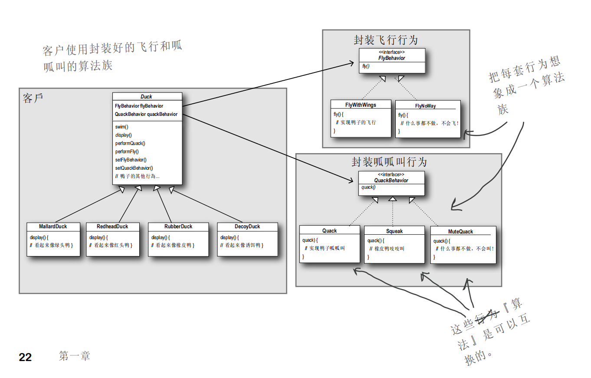
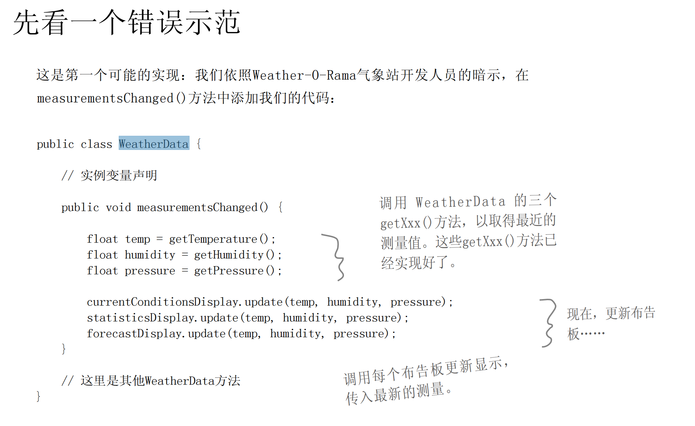
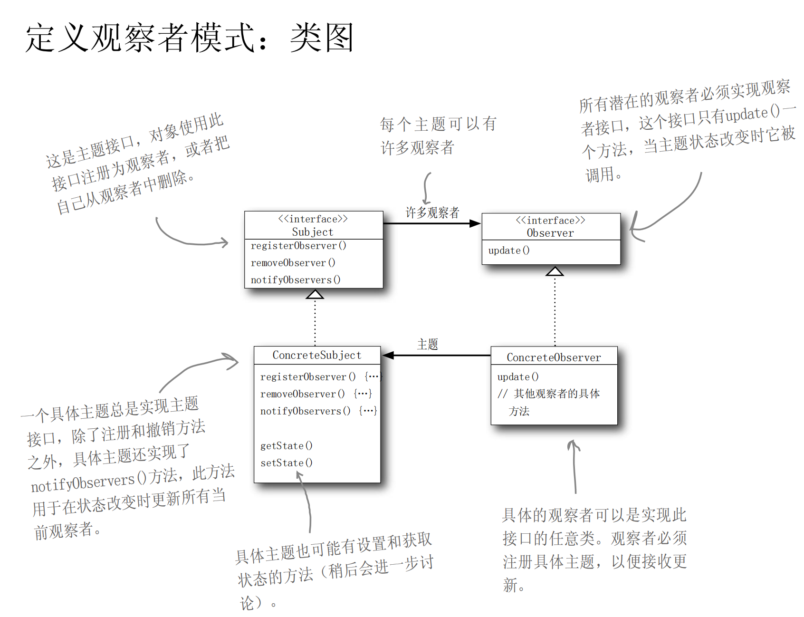

# 设计模式
## [strategy](strategy) 
策略模式

## [observer](observer)
观察者模式
    
恭喜贵公司获选为敝公司建立下一代Internet气象观测站!该气象站必须建立在我们专利申请中的WeatherData对象上，由WeatherData对象负责追踪目前的天气状况(温度、湿度、气压)。我们希望贵公司能建立一个应用，有三种布告板，分别显示目前的状况、气象统计及简单的预报。当WeatherObject对象获得最新的测量数据时，三种布告板必须实时更新。
而且，这是一个可以扩展的气象站，Weather-0-Rama气象站希望公布一组API,好让其他开发人员可以写出自己的气象布告板，并插入此应用中。我们希望贵公司能提供这样的API。
Weather-0-Rama气象站有很好的商业营运模式：一旦客户上钩，他们使用每个布告板都要付钱。最好的部分就是，为了感谢贵公司建立此系统，我们将以公司的认股权支付你。

简单的观察者模式 [demo](observer%2Fsrc%2Fmain%2Fjava%2Forg%2Fexample%2Fdemo)
气象站实现观察者模式 [demo2](observer%2Fsrc%2Fmain%2Fjava%2Forg%2Fexample%2Fdemo2)
## [decorator](decorator)
装饰者模式
