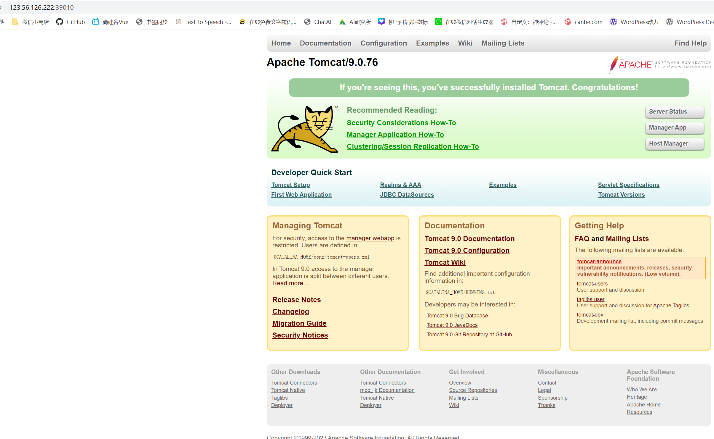

# Docker概述（入门）

## 学习资料

> 官网

https://www.docker.com/

> 帮助文档

https://docs.docker.com/

> docker镜像源大全

https://developer.aliyun.com/article/1113403

## Docker是什么？

>概念

Docker 是一个开源的应用容器引擎，让开发者可以打包他们的应用以及依赖包到一个可移植的[镜像](https://baike.baidu.com/item/镜像/1574?fromModule=lemma_inlink)中，然后发布到任何流行的 Linux或[Windows](https://baike.baidu.com/item/Windows/165458?fromModule=lemma_inlink)操作系统的机器上，也可以实现虚拟化。容器是完全使用沙箱机制，相互之间不会有任何接口。


顾名思义，docker是一个容器引擎，容器且不说，什么是引擎？

我们知道：汽车的引擎是发动机，有了发动起，汽车才能跑起来；游戏需要游戏引擎（如Unity3D..），基于引擎的开发，能让游戏动起来。如官言，docker也是一种引擎，基于这个引擎，开发者能让他们开发的应用处于一个有隔离性的、可移植性的容器中，以便于发布于各种机器中而无需考虑兼容性问题。

因此就不难解释，为什么docker的logo是一条装着一堆箱子的鲸鱼。

这是因为：docker扮演的是图中鲸鱼的角色，而鲸鱼之上的集装箱就是一个个容器，容器中是我们开发的应用程序（不仅限于web应用），每个容器都有自己独立的环境（环境设置、网络、文件系统...），互不干扰。而每个箱子，又可以打包成一个新的镜像，放到其它服务器的docker环境中直接运行，不再需要重复安装程序运行环境。

一个完整的Docker有以下几个部分组成：

1. DockerClient客户端
2. Docker Daemon守护进程
3. Docker Image镜像
4. DockerContainer容器

## Docker为什么会出现？

> 案例一

前几天，公司一批服务器就要到期了，由于服务器是15年购买的，硬件的性能远比现在新出的云主机低，因此决定把所有服务器都换成新一代服务器，但是小编整准备动手迁移服务器时，内心一阵阵崩溃感涌上心头，仔细一算，每台服务器都要做同样的事情：

1. 安装jdk、Tomcat、nginx

2. 配置jdk环境变量和系统变量

3. 配置Tomcat

4. 配置nginx

5. 安装项目所需的视频解码组件

6. 导入项目所需的一些特殊字体

后来决定用docker部署的办法，在每台服务器都把docker安装之后，只需要在其中一台服务器中把Tomcat镜像从镜像仓库拉取下来，把这些配置都设置好，做成一个自己的镜像上传到镜像仓库中，之后在其他几台服务器都下载自己做的镜像，运行于docker中，把代码上传，就万事大吉了。

> 案例二

前不久的圣诞活动中，公司临时的活动方案在程序员的加班加点中终于上线，但是一上线之后发现推广海报中的中文名字乱码，领导问责测试人员怎么没做好测试，测试很委屈的说我已经测试无数遍并且测试报告都提交了，解决了所有问题才上线的；没办法只能让服务器同事查看正式服务器中的tomcat配置，发现原来 tomcat用了默认编码方式：iso8859-1，而测试环境中是UTF-8。针对这个问题，项目组决定把开发环境迁移到docker中，在测试环境中测试无误后，把镜像打包发布到正式环境中，解决了环境不同导致的问题。

> Docker 的优点

1. 快速，一致地交付您的应用程序

   Docker 允许开发人员使用您提供的应用程序或服务的本地容器在标准化环境中工作，从而简化了开发的生命周期。容器非常适合持续集成和持续交付（CI / CD）工作流程，请考虑以下示例方案：

   - 您的开发人员在本地编写代码，并使用 Docker 容器与同事共享他们的工作。
   - 他们使用 Docker 将其应用程序推送到测试环境中，并执行自动或手动测试。
   - 当开发人员发现错误时，他们可以在开发环境中对其进行修复，然后将其重新部署到测试环境中，以进行测试和验证。
   - 测试完成后，将修补程序推送给生产环境，就像将更新的镜像推送到生产环境一样简单。

2. 响应式部署和扩展

   Docker 是基于容器的平台，允许高度可移植的工作负载。Docker 容器可以在开发人员的本机上，数据中心的物理或虚拟机上，云服务上或混合环境中运行。Docker 的可移植性和轻量级的特性，还可以使您轻松地完成动态管理的工作负担，并根据业务需求指示，实时扩展或拆除应用程序和服务。

3. 在同一硬件上运行更多工作负载

   Docker 轻巧快速。它为基于虚拟机管理程序的虚拟机提供了可行、经济、高效的替代方案，因此您可以利用更多的计算能力来实现业务目标。Docker 非常适合于高密度环境以及中小型部署，而您可以用更少的资源做更多的事情。

## **Docker能干什么**?

## **Docker和传统虚拟机的不同**?

## Docker的历史？

# Docker安装与卸载（入门）

## **Docker的基本组成**

镜像：镜像就像是一个模板，通过模板可以创建容器服务

容器：docker利用容器技术，当立运行一个或者一个组应用，通过镜像创建容器，可以理解为就是一个简易的linux系统

仓库：仓库就是存放镜像的地方，公有仓库（Docker hub）和私有仓库

## 安装

> 环境查看

```shell
# 系统内核是3.10以上的
[root@CentOS7-001 /]# uname -r
3.10.0-693.2.2.el7.x86_64
```

> 系统配置

```shell
# 查看系统信息
[root@CentOS7-001 /]# cat /etc/os-release 
NAME="CentOS Linux"
VERSION="7 (Core)"
ID="centos"
ID_LIKE="rhel fedora"
VERSION_ID="7"
PRETTY_NAME="CentOS Linux 7 (Core)"
ANSI_COLOR="0;31"
CPE_NAME="cpe:/o:centos:centos:7"
HOME_URL="https://www.centos.org/"
BUG_REPORT_URL="https://bugs.centos.org/"

CENTOS_MANTISBT_PROJECT="CentOS-7"
CENTOS_MANTISBT_PROJECT_VERSION="7"
REDHAT_SUPPORT_PRODUCT="centos"
REDHAT_SUPPORT_PRODUCT_VERSION="7"
```

> 安装步骤

1、系统要求，必须使用如下系统

- CentOS 7
- CentOS 8 (stream)
- CentOS 9 (stream)

2、卸载之前的docker

```shell
 sudo yum remove docker \
                  docker-client \
                  docker-client-latest \
                  docker-common \
                  docker-latest \
                  docker-latest-logrotate \
                  docker-logrotate \
                  docker-engine
```

3、建立仓库

```shell
# 安装必要的一些系统工具
sudo yum install -y yum-utils device-mapper-persistent-data lvm2
# 添加软件源信息，默认是国外的很慢
# sudo yum-config-manager --add-repo https://download.docker.com/linux/centos/docker-ce.repo
# 我们使用国内阿里云的，可参考帖子https://developer.aliyun.com/article/1113403
sudo yum-config-manager --add-repo http://mirrors.aliyun.com/docker-ce/linux/centos/docker-ce.repo
```

**阿里云服务器设置镜像加速，提高下载速度**

[配置镜像加速器](#配置镜像加速器)

4、更新yum软件包索引

```shell
[root@CentOS7-001 ~]# yum makecache fast
```

我安装到这里的时候发生报错，如果你未遇到则恭喜你，你可以跳过下面的内容，直接跳转到步骤5

报错信息：repodata/repomd.xml from cr.console.aliyun.com: [Errno 256] No more mirrors to try.

报接解决办法如下：

```shell
# 1、目前所有添加的镜像仓库
[root@CentOS7-001 ~]# cd  /etc/yum.repos.d/
[root@CentOS7-001 yum.repos.d]# ls
CentOS-Base.repo            docker-ce.repo  epel.repo.rpmnew   hub-mirror.c.163.com.repo
cr.console.aliyun.com.repo  epel.repo       epel-testing.repo  mirrors.ustc.edu.cn_.repo
# 2、卸载这些包，这些源都有问题
[root@CentOS7-001 yum.repos.d]# rm -rf cr.console.aliyun.com.repo
[root@CentOS7-001 yum.repos.d]# rm -rf hub-mirror.c.163.com.repo
[root@CentOS7-001 yum.repos.d]# rm -rf mirrors.ustc.edu.cn_.repo
# 3、删除上述仓库口再次清楚yum缓存，就好了
[root@CentOS7-001 yum.repos.d]# yum makecache fast
# 4、查看 CentOS-Base.repo源配置
[root@CentOS7-001 yum.repos.d]# vi CentOS-Base.repo
#如下是CentOS-Base.repo的全部配置
[base]
name=CentOS-$releasever
enabled=1
failovermethod=priority
baseurl=http://mirrors.cloud.aliyuncs.com/centos/$releasever/os/$basearch/
gpgcheck=1
gpgkey=http://mirrors.cloud.aliyuncs.com/centos/RPM-GPG-KEY-CentOS-7

[updates]
name=CentOS-$releasever
enabled=1
failovermethod=priority
baseurl=http://mirrors.cloud.aliyuncs.com/centos/$releasever/updates/$basearch/
gpgcheck=1
gpgkey=http://mirrors.cloud.aliyuncs.com/centos/RPM-GPG-KEY-CentOS-7

[extras]
name=CentOS-$releasever
enabled=1
failovermethod=priority
baseurl=http://mirrors.cloud.aliyuncs.com/centos/$releasever/extras/$basearch/
gpgcheck=1
gpgkey=http://mirrors.cloud.aliyuncs.com/centos/RPM-GPG-KEY-CentOS-7
```

5、安装docker

```shell
# ce是社区版的，ee是企业版的
sudo yum install docker-ce docker-ce-cli containerd.io docker-buildx-plugin docker-compose-plugin
```

6、启动docker

```shell
[root@CentOS7-001 yum.repos.d]# sudo systemctl start docker
```

7、检查docker是否安装成功

```shell
[root@CentOS7-001 yum.repos.d]# docker version
Client: Docker Engine - Community
 Version:           24.0.2
 API version:       1.43
 Go version:        go1.20.4
 Git commit:        cb74dfc
 Built:             Thu May 25 21:55:21 2023
 OS/Arch:           linux/amd64
 Context:           default

Server: Docker Engine - Community
 Engine:
  Version:          24.0.2
  API version:      1.43 (minimum version 1.12)
  Go version:       go1.20.4
  Git commit:       659604f
  Built:            Thu May 25 21:54:24 2023
  OS/Arch:          linux/amd64
  Experimental:     false
 containerd:
  Version:          1.6.21
  GitCommit:        3dce8eb055cbb6872793272b4f20ed16117344f8
 runc:
  Version:          1.1.7
  GitCommit:        v1.1.7-0-g860f061
 docker-init:
  Version:          0.19.0
  GitCommit:        de40ad0
```

8、运行helloworld

```shell
[root@CentOS7-001 yum.repos.d]# sudo docker run hello-world
Unable to find image 'hello-world:latest' locally #没有找到镜像
latest: Pulling from library/hello-world #从仓库拉取镜像
2db29710123e: Pull complete #拉去成功
Digest: sha256:2498fce14358aa50ead0cc6c19990fc6ff866ce72aeb5546e1d59caac3d0d60f
Status: Downloaded newer image for hello-world:latest

Hello from Docker!#说明运行成功了
This message shows that your installation appears to be working correctly.

To generate this message, Docker took the following steps:
 1. The Docker client contacted the Docker daemon.
 2. The Docker daemon pulled the "hello-world" image from the Docker Hub.
    (amd64)
 3. The Docker daemon created a new container from that image which runs the
    executable that produces the output you are currently reading.
 4. The Docker daemon streamed that output to the Docker client, which sent it
    to your terminal.

To try something more ambitious, you can run an Ubuntu container with:
 $ docker run -it ubuntu bash

Share images, automate workflows, and more with a free Docker ID:
 https://hub.docker.com/

For more examples and ideas, visit:
 https://docs.docker.com/get-started/
```

有兴趣的同学可以学习下Docker Run到底是如何运行的？

[Docker的运行流程图](#Docker的运行流程图)

9、查看下镜像是否存在

```shell
[root@CentOS7-001 yum.repos.d]# docker images
REPOSITORY    TAG       IMAGE ID       CREATED         SIZE
hello-world   latest    feb5d9fea6a5   21 months ago   13.3kB #说明镜像已经拉取到了本地
```

## 卸载

1、卸载docker

```shell
sudo yum remove docker-ce docker-ce-cli containerd.io docker-buildx-plugin docker-compose-plugin docker-ce-rootless-extras
```

2、删除资源

```shell
sudo rm -rf /var/lib/docker
sudo rm -rf /var/lib/containerd
```

# Docker底层原理（入门）

## Docker是怎么工作的？

Docker是一个Client - Server 结构的系统，Docker的守护线程运行在宿主机上，通过Socket从客户端访问！，Docker-Server接受Docker-Client的指令，就会执行这个指令


## Docker为什么比VM快？

1、Docker有比比你及更少的抽象层

2、docker利用的是宿主机的内核，VM需要guest OS

所以说新建一个容器的时候，docker不需要像虚拟机一样重新加载一个操作系统内核，避免引导、虚拟机加载Guest OS，分钟级，而Docker是利用宿主机的操作系统，省略了这个复杂的过程，秒级。

# Docker的常用命令（入门）

## 帮助命令

```shell
docker version 	#显示docker的版本信息
docker info		#显示idocker的系统信息
docker 命令 --help	#帮助命令
```

帮助文档的地址：https://docs.docker.com/engine/reference

## 镜像命令

### **docker images** 查看本地所有镜像

```shell
[root@CentOS7-001 ~]# docker images
REPOSITORY    TAG       IMAGE ID       CREATED         SIZE
hello-world   latest    feb5d9fea6a5   21 months ago   13.3kB

#解释
REPOSITORY 	镜像的仓库源
TAG			镜像的标签
IMAGE ID	镜像的id
CREATED		镜像的创建时间
SIZE		镜像的大小

# 可选项
Options:
  -a, --all             Show all images (default hides intermediate images)	#列出所有镜像
  -q, --quiet           Only show image IDs	#只显示镜像的id
```

### **docker search** 搜索

```shell
docker search --filter stars=10000 mysql #以mysql为关键字，搜索stars最少为10000的镜像
```

### **docker pull** 下载镜像

```shell
# docker pull [OPTIONS] 镜像名称[:版本]
[root@CentOS7-001 ~]# docker pull mysql #不写版本默认就是latest
Using default tag: latest
latest: Pulling from library/mysql
72a69066d2fe: Pull complete 	#分层下载 docker的核心
93619dbc5b36: Pull complete 
99da31dd6142: Pull complete 
626033c43d70: Pull complete 
37d5d7efb64e: Pull complete 
ac563158d721: Pull complete 
d2ba16033dad: Pull complete 
688ba7d5c01a: Pull complete 
00e060b6d11d: Pull complete 
1c04857f594f: Pull complete 
4d7cfa90e6ea: Pull complete 
e0431212d27d: Pull complete 
Digest: sha256:e9027fe4d91c0153429607251656806cc784e914937271037f7738bd5b8e7709	#签名
Status: Downloaded newer image for mysql:latest
docker.io/library/mysql:latest	# 真实地址

# 等价的
docker pull mysql
docker pull docker.io/library/mysql:latest

# 指定版本号， []是可以省略掉的
[root@CentOS7-001 ~]# docker pull mysql:5.7
5.7: Pulling from library/mysql
72a69066d2fe: Already exists 	#分层下载，这里已经存在
93619dbc5b36: Already exists 
99da31dd6142: Already exists 
626033c43d70: Already exists 
37d5d7efb64e: Already exists 
ac563158d721: Already exists 
d2ba16033dad: Already exists 
0ceb82207cd7: Pull complete 	#这里是不存在的才下载
37f2405cae96: Pull complete 
e2482e017e53: Pull complete 
70deed891d42: Pull complete 
Digest: sha256:f2ad209efe9c67104167fc609cca6973c8422939491c9345270175a300419f94
Status: Downloaded newer image for mysql:5.7
docker.io/library/mysql:5.
```

### **docker rmi** 删除镜像

```shell
# 删除指定镜像
[root@CentOS7-001 ~]# docker rmi -f c20987f18b13 
Untagged: mysql:5.7
Untagged: mysql@sha256:f2ad209efe9c67104167fc609cca6973c8422939491c9345270175a300419f94
Deleted: sha256:c20987f18b130f9d144c9828df630417e2a9523148930dc3963e9d0dab302a76
Deleted: sha256:6567396b065ee734fb2dbb80c8923324a778426dfd01969f091f1ab2d52c7989
Deleted: sha256:0910f12649d514b471f1583a16f672ab67e3d29d9833a15dc2df50dd5536e40f
Deleted: sha256:6682af2fb40555c448b84711c7302d0f86fc716bbe9c7dc7dbd739ef9d757150
Deleted: sha256:5c062c3ac20f576d24454e74781511a5f96739f289edaadf2de934d06e910b92

# 删除多个镜像
[root@CentOS7-001 ~]# docker rmi -f 镜像id1 镜像id2 镜像id3 镜像id4 

# 删除全部的容器 将docker images -qa的结果当作参数传递给docker rmi
[root@CentOS7-001 ~]# docker rmi -f $(docker images -qa)

# 明明镜像存在，镜像删除时却报错提示，No such image，原因是镜像未使用过，使用docker image prune 删除未使用镜像
[root@CentOS7-001 WEB-INF]# docker rmi -f bebb57153607:1.0
Error response from daemon: No such image: bebb57153607:1.0
[root@CentOS7-001 WEB-INF]# docker image prune -a 
```

## 容器命令

> 我们有了镜像，才能创建容器

### **下载镜像**

```shell
[root@CentOS7-001 ~]# docker pull centos
```

### **docker run 新建容器并启动**

> docker run [可选参数] image

```shell
# 参数说明
--name 	容器的名称，例如：tomcat01 tomcat02
-d 		后代运行方式
-it 	使用交互方式运行
-p 		指定容器的端口 -p 8080:8080
	-p	ip:主机端口:容器端口
	-p	主机端口:容器端口 （常用）
	-p	容器端口
	容器端口
-P		随机指定端口

# 测试，启动并进入容器
[root@CentOS7-001 ~]# docker run -it centos /bin/bash
[root@645b3f29b5db /]# ls 	# 查看容器内的centos，基础版本，很多命令无法使用
bin  dev  etc  home  lib  lib64  lost+found  media  mnt  opt  proc  root  run  sbin  srv  sys  tmp  usr  var
[root@645b3f29b5db /]# exit	# 退出容器
exit
[root@CentOS7-001 ~]# 
```

### **docker ps 列出所有运行的容器**

>docker ps

```shell
# 参数说明
		# 列出当前正在运行的容器
-a 		# 列出当前正在运行的容器 + 历史运行的容器
-n=?	#显示最近创建的n个容器
-q		# 只显示容器的id
[root@CentOS7-001 /]# docker ps
CONTAINER ID   IMAGE     COMMAND   CREATED   STATUS    PORTS     NAMES
[root@CentOS7-001 /]# docker ps -a
CONTAINER ID   IMAGE          COMMAND       CREATED         STATUS                     PORTS     NAMES
645b3f29b5db   centos         "/bin/bash"   5 minutes ago   Exited (0) 2 minutes ago             infallible_bardeen
df0d5c6adc2f   feb5d9fea6a5   "/hello"      16 hours ago    Exited (0) 16 hours ago              sad_williamson


```

### **exit 退出容器**

```shell
exit	# 容器停止并退出
Ctrl + P + Q	#容器不停止退出
```

### **docker rm 删除容器**

```shell
docker rm 容器id	# 删除指定容器，不能删除运行中的容器，要删除运行中的容器可以使用 docker rm -f
docker rm 容器id1 容器id2 # 删除多个容器
docker rm -f $(docker ps -qa)	# 删除所有容器,不管是否运行中

# 等价
docker rm $(docker ps --filter status=exited -q) # 删除所有已退出的容器
docker ps --filter status=exited -q | xargs docker rm # 删除所有已退出的容器
```

### docker start 启用或停止容器

```shell
docker start 容器id	# 启动容器
docker restart 容器id	# 重启容器
docker stop 容器id	# 停止正在运行的容器
docker kill 容器id	# 强制停止当前容器
```

## 常用其他命令

### **docker run -d 后台启动容器**

```shell
#命令 dockers run -d 镜像名
[root@CentOS7-001 /]# docker run -d centos	#使用docker ps 发现centos启动后又停止了

# 常见的坑，容器使用后台运行，就必须要有一个前台进程， docker发现自己没有提供服务就会立刻停止
```

### **docker logs 查看日志命令**

```shell
# 命令 docker logs [OPTIONS] 容器
docker logs -f -t --tail 容器， 没有日志

#参数说明
-f	# 控制台输出日志
-t	# 显示时间戳
--tail number	# 从尾行显示多少日志

# 启动容器
[root@CentOS7-001 /]# docker run -d centos /bin/bash -c "while true; do echo haha ; sleep 1; done"

# 查看容器是否启动
[root@CentOS7-001 /]# docker ps
CONTAINER ID   IMAGE     COMMAND                  CREATED         STATUS         PORTS     NAMES
3220efa50f2a   centos    "/bin/bash -c 'while…"   5 seconds ago   Up 4 seconds             angry_hopper

# 显示日志，显示最新10条
docker logs -tf --tail 10  3220efa50f2a 
# 显示所有
docker logs -tf 3220efa50f2a 

```

### **docker top 查看容器中的进程信息**

```shell
docker top 容器id
```

### **docker inspect 查看镜像的元数据**

```shell
# 命令 docker inspect 容器id
[root@CentOS7-001 /]# docker inspect 3220efa50f2a
[
    {
        "Id": "3220efa50f2a1a9c41048408d0ce965fa125b9c371bd468a5b518811dcc780a6",
        "Created": "2023-06-26T15:42:08.578726832Z",
        "Path": "/bin/bash",
        "Args": [
            "-c",
            "while true; do echo haha ; sleep 1; done"
        ],
        "State": {
            "Status": "exited",
            "Running": false,
            "Paused": false,
            "Restarting": false,
            "OOMKilled": false,
            "Dead": false,
            "Pid": 0,
            "ExitCode": 137,
            "Error": "",
            "StartedAt": "2023-06-26T15:42:08.844625765Z",
            "FinishedAt": "2023-06-26T15:46:07.929742862Z"
        },
        "Image": "sha256:5d0da3dc976460b72c77d94c8a1ad043720b0416bfc16c52c45d4847e53fadb6",
        "ResolvConfPath": "/var/lib/docker/containers/3220efa50f2a1a9c41048408d0ce965fa125b9c371bd468a5b518811dcc780a6/resolv.conf",
        "HostnamePath": "/var/lib/docker/containers/3220efa50f2a1a9c41048408d0ce965fa125b9c371bd468a5b518811dcc780a6/hostname",
        "HostsPath": "/var/lib/docker/containers/3220efa50f2a1a9c41048408d0ce965fa125b9c371bd468a5b518811dcc780a6/hosts",
        "LogPath": "/var/lib/docker/containers/3220efa50f2a1a9c41048408d0ce965fa125b9c371bd468a5b518811dcc780a6/3220efa50f2a1a9c41048408d0ce965fa125b9c371bd468a5b518811dcc780a6-json.log",
        "Name": "/angry_hopper",
        "RestartCount": 0,
        "Driver": "overlay2",
        "Platform": "linux",
        "MountLabel": "",
        "ProcessLabel": "",
        "AppArmorProfile": "",
        "ExecIDs": null,
        "HostConfig": {
            "Binds": null,
            "ContainerIDFile": "",
            "LogConfig": {
                "Type": "json-file",
                "Config": {}
            },
            "NetworkMode": "default",
            "PortBindings": {},
            "RestartPolicy": {
                "Name": "no",
                "MaximumRetryCount": 0
            },
            "AutoRemove": false,
            "VolumeDriver": "",
            "VolumesFrom": null,
            "ConsoleSize": [
                43,
                167
            ],
            "CapAdd": null,
            "CapDrop": null,
            "CgroupnsMode": "host",
            "Dns": [],
            "DnsOptions": [],
            "DnsSearch": [],
            "ExtraHosts": null,
            "GroupAdd": null,
            "IpcMode": "private",
            "Cgroup": "",
            "Links": null,
            "OomScoreAdj": 0,
            "PidMode": "",
            "Privileged": false,
            "PublishAllPorts": false,
            "ReadonlyRootfs": false,
            "SecurityOpt": null,
            "UTSMode": "",
            "UsernsMode": "",
            "ShmSize": 67108864,
            "Runtime": "runc",
            "Isolation": "",
            "CpuShares": 0,
            "Memory": 0,
            "NanoCpus": 0,
            "CgroupParent": "",
            "BlkioWeight": 0,
            "BlkioWeightDevice": [],
            "BlkioDeviceReadBps": [],
            "BlkioDeviceWriteBps": [],
            "BlkioDeviceReadIOps": [],
            "BlkioDeviceWriteIOps": [],
            "CpuPeriod": 0,
            "CpuQuota": 0,
            "CpuRealtimePeriod": 0,
            "CpuRealtimeRuntime": 0,
            "CpusetCpus": "",
            "CpusetMems": "",
            "Devices": [],
            "DeviceCgroupRules": null,
            "DeviceRequests": null,
            "MemoryReservation": 0,
            "MemorySwap": 0,
            "MemorySwappiness": null,
            "OomKillDisable": false,
            "PidsLimit": null,
            "Ulimits": null,
            "CpuCount": 0,
            "CpuPercent": 0,
            "IOMaximumIOps": 0,
            "IOMaximumBandwidth": 0,
            "MaskedPaths": [
                "/proc/asound",
                "/proc/acpi",
                "/proc/kcore",
                "/proc/keys",
                "/proc/latency_stats",
                "/proc/timer_list",
                "/proc/timer_stats",
                "/proc/sched_debug",
                "/proc/scsi",
                "/sys/firmware"
            ],
            "ReadonlyPaths": [
                "/proc/bus",
                "/proc/fs",
                "/proc/irq",
                "/proc/sys",
                "/proc/sysrq-trigger"
            ]
        },
        "GraphDriver": {
            "Data": {
                "LowerDir": "/var/lib/docker/overlay2/5ac085ff6072b99f71dbf4aaf6af0f36d7d31c5b4e3dea7a9db89522367c5d40-init/diff:/var/lib/docker/overlay2/63dd501c479359626b24fde3e05b31f512e1d1c30b0ec81ac35de7ab5851cf21/diff",
                "MergedDir": "/var/lib/docker/overlay2/5ac085ff6072b99f71dbf4aaf6af0f36d7d31c5b4e3dea7a9db89522367c5d40/merged",
                "UpperDir": "/var/lib/docker/overlay2/5ac085ff6072b99f71dbf4aaf6af0f36d7d31c5b4e3dea7a9db89522367c5d40/diff",
                "WorkDir": "/var/lib/docker/overlay2/5ac085ff6072b99f71dbf4aaf6af0f36d7d31c5b4e3dea7a9db89522367c5d40/work"
            },
            "Name": "overlay2"
        },
        "Mounts": [],
        "Config": {
            "Hostname": "3220efa50f2a",
            "Domainname": "",
            "User": "",
            "AttachStdin": false,
            "AttachStdout": false,
            "AttachStderr": false,
            "Tty": false,
            "OpenStdin": false,
            "StdinOnce": false,
            "Env": [
                "PATH=/usr/local/sbin:/usr/local/bin:/usr/sbin:/usr/bin:/sbin:/bin"
            ],
            "Cmd": [
                "/bin/bash",
                "-c",
                "while true; do echo haha ; sleep 1; done"
            ],
            "Image": "centos",
            "Volumes": null,
            "WorkingDir": "",
            "Entrypoint": null,
            "OnBuild": null,
            "Labels": {
                "org.label-schema.build-date": "20210915",
                "org.label-schema.license": "GPLv2",
                "org.label-schema.name": "CentOS Base Image",
                "org.label-schema.schema-version": "1.0",
                "org.label-schema.vendor": "CentOS"
            }
        },
        "NetworkSettings": {
            "Bridge": "",
            "SandboxID": "1e51e66af7497bca8cee49059ba12b49bd5ae855ffce148660b572a731da1a05",
            "HairpinMode": false,
            "LinkLocalIPv6Address": "",
            "LinkLocalIPv6PrefixLen": 0,
            "Ports": {},
            "SandboxKey": "/var/run/docker/netns/1e51e66af749",
            "SecondaryIPAddresses": null,
            "SecondaryIPv6Addresses": null,
            "EndpointID": "",
            "Gateway": "",
            "GlobalIPv6Address": "",
            "GlobalIPv6PrefixLen": 0,
            "IPAddress": "",
            "IPPrefixLen": 0,
            "IPv6Gateway": "",
            "MacAddress": "",
            "Networks": {
                "bridge": {
                    "IPAMConfig": null,
                    "Links": null,
                    "Aliases": null,
                    "NetworkID": "adaed4bda4868b780a21c82b8699e74a20781165336561ee8c32457654f8a1ad",
                    "EndpointID": "",
                    "Gateway": "",
                    "IPAddress": "",
                    "IPPrefixLen": 0,
                    "IPv6Gateway": "",
                    "GlobalIPv6Address": "",
                    "GlobalIPv6PrefixLen": 0,
                    "MacAddress": "",
                    "DriverOpts": null
                }
            }
        }
    }
]

```

### docker exec/attach 进入当前正在运行的容器

```shell
# 通常容器我们都是通过后台方式运行的，需要进入容器进行配置

# 命令，进入容器后开启一个新的终端
docker exec -it 容器id /bin/bash


# 方式二，进入容器正在执行的终端，不会启用新的终端
docker attach 容器id

# 测试1
[root@CentOS7-001 home]# docker ps -a
CONTAINER ID   IMAGE     COMMAND       CREATED          STATUS                     PORTS     NAMES
83d794f9918d   centos    "/bin/bash"   10 minutes ago   Exited (0) 8 minutes ago             bold_bassi
[root@CentOS7-001 home]# docker attach 83d794f9918d	
You cannot attach to a stopped container, start it first	# 可以看到docker attach只能进正在运行的容器
[root@CentOS7-001 home]# docker exec -it 83d794f9918d /bin/bash
Error response from daemon: Container 83d794f9918d243a42c11f0aa235cc68f47a53c4399437e6e79f7145e4757446 is not running	# 同样docker exec只能进正在运行的容器

#测试2 
[root@CentOS7-001 home]# docker attach 83d794f9918d	
[root@83d794f9918d /]# ls	#可以进来
bin  dev  etc  home  lib  lib64  lost+found  media  mnt  opt  proc  root  run  sbin  srv  sys  tmp  usr  var
[root@CentOS7-001 home]# docker exec -it 83d794f9918d /bin/bash	
[root@83d794f9918d /]# ls	#可以进来
bin  dev  etc  home  lib  lib64  lost+found  media  mnt  opt  proc  root  run  sbin  srv  sys  tmp  usr  var


```

### **docker cp  从容器内考贝文件到主机上**

>这里的拷贝使用的是手动的方式，未来我们使用数据卷的方式，可以实现自动同步

```shell
# 命令
docker cp 容器id:容器内路径 目标主机路径

# 测试
[root@CentOS7-001 home]# docker attach 83d794f9918d	# 进入容器
[root@83d794f9918d /]# cd /home
[root@83d794f9918d home]# ls
[root@83d794f9918d home]# touch test.java	# home目录下创建测试文件
[root@83d794f9918d home]# ls
test.java
[root@83d794f9918d home]# exit	# 退出容器
exit
[root@CentOS7-001 home]# docker ps -a # 拷贝与容器是否运行没有关系，可以看到该容器确实未运行
CONTAINER ID   IMAGE     COMMAND       CREATED         STATUS                     PORTS     NAMES
83d794f9918d   centos    "/bin/bash"   2 minutes ago   Exited (0) 6 seconds ago             bold_bassi
[root@CentOS7-001 home]# docker cp 83d794f9918d:/home/test.java /home # 拷贝
Successfully copied 1.54kB to /home
[root@CentOS7-001 home]# ls	# 测试文件确实拷贝了出来
haha.java  test.java  www
```

### 命令小结

> 命令大全


```shell
Common Commands:
  run         Create and run a new container from an image
  exec        Execute a command in a running container
  ps          List containers
  build       Build an image from a Dockerfile
  pull        Download an image from a registry
  push        Upload an image to a registry
  images      List images
  login       Log in to a registry
  logout      Log out from a registry
  search      Search Docker Hub for images
  version     Show the Docker version information
  info        Display system-wide information

Management Commands:
  builder     Manage builds
  buildx*     Docker Buildx (Docker Inc., v0.10.5)
  compose*    Docker Compose (Docker Inc., v2.18.1)
  container   Manage containers
  context     Manage contexts
  image       Manage images
  manifest    Manage Docker image manifests and manifest lists
  network     Manage networks
  plugin      Manage plugins
  system      Manage Docker
  trust       Manage trust on Docker images
  volume      Manage volumes

Swarm Commands:
  swarm       Manage Swarm

Commands:
  attach      Attach local standard input, output, and error streams to a running container
  commit      Create a new image from a container's changes
  cp          Copy files/folders between a container and the local filesystem
  create      Create a new container
  diff        Inspect changes to files or directories on a container's filesystem
  events      Get real time events from the server
  export      Export a container's filesystem as a tar archive
  history     Show the history of an image
  import      Import the contents from a tarball to create a filesystem image
  inspect     Return low-level information on Docker objects
  kill        Kill one or more running containers
  load        Load an image from a tar archive or STDIN
  logs        Fetch the logs of a container
  pause       Pause all processes within one or more containers
  port        List port mappings or a specific mapping for the container
  rename      Rename a container
  restart     Restart one or more containers
  rm          Remove one or more containers
  rmi         Remove one or more images
  save        Save one or more images to a tar archive (streamed to STDOUT by default)
  start       Start one or more stopped containers
  stats       Display a live stream of container(s) resource usage statistics
  stop        Stop one or more running containers
  tag         Create a tag TARGET_IMAGE that refers to SOURCE_IMAGE
  top         Display the running processes of a container
  unpause     Unpause all processes within one or more containers
  update      Update configuration of one or more containers
  wait        Block until one or more containers stop, then print their exit codes

Global Options:
      --config string      Location of client config files (default "/root/.docker")
  -c, --context string     Name of the context to use to connect to the daemon (overrides DOCKER_HOST env var and default context set with "docker context use")
  -D, --debug              Enable debug mode
  -H, --host list          Daemon socket to connect to
  -l, --log-level string   Set the logging level ("debug", "info", "warn", "error", "fatal") (default "info")
      --tls                Use TLS; implied by --tlsverify
      --tlscacert string   Trust certs signed only by this CA (default "/root/.docker/ca.pem")
      --tlscert string     Path to TLS certificate file (default "/root/.docker/cert.pem")
      --tlskey string      Path to TLS key file (default "/root/.docker/key.pem")
      --tlsverify          Use TLS and verify the remote
  -v, --version            Print version information and quit
```

### 作业练习

> 安装nginx

```shell
# 1、搜索镜像，search 建议去dockers hub上可以查看详细信息
# 2、下载镜像
[root@CentOS7-001 home]# docker pull nginx

# 3、后台启动nginx，命名为nignx01,并使用端口公网3344访问nginx01
# -d 后台运行
# --name 容器起名字
# -p 宿主机端口:容器内部端口
[root@CentOS7-001 home]# docker run -d --name nignx01 -p 3344:80 nginx
[root@CentOS7-001 home]# docker ps
CONTAINER ID   IMAGE     COMMAND                  CREATED          STATUS          PORTS                  NAMES
2dadeacc1889   nginx     "/docker-entrypoint.…"   8 seconds ago    Up 7 seconds    0.0.0.0:3344->80/tcp   nignx01
4f7af4f0028a   nginx     "/docker-entrypoint.…"   6 minutes ago    Up 6 minutes    80/tcp                 agitated_shamir
83d794f9918d   centos    "/bin/bash"              44 minutes ago   Up 27 minutes                          bold_bassi

# 4、运行测试
[root@CentOS7-001 home]# curl localhost:3344
<!DOCTYPE html>
<html>
<head>
<title>Welcome to nginx!</title>
<style>
html { color-scheme: light dark; }
body { width: 35em; margin: 0 auto;
font-family: Tahoma, Verdana, Arial, sans-serif; }
</style>
</head>
<body>
<h1>Welcome to nginx!</h1>
<p>If you see this page, the nginx web server is successfully installed and
working. Further configuration is required.</p>

<p>For online documentation and support please refer to
<a href="http://nginx.org/">nginx.org</a>.<br/>
Commercial support is available at
<a href="http://nginx.com/">nginx.com</a>.</p>

<p><em>Thank you for using nginx.</em></p>
</body>
</html>

```

**端口的概念**

阿里云安全组和防火墙必须同时开启才外网才可以访问到服务器，再通过映射端口就可以访问到容器


注意：我们每次改动nginx配置文件，都需要进入容器内部，十分的麻烦，我们要是可以在容器外部提供一个映射路径，在容器外部部署项目/修改配置文件，容器内部就可以自动修改。 ==使用数据卷==

> 安装tomcat

```shell
# 官方使用， 我们之前的启动都是后台，停止了容器之后，容器还是可以查到的，docker run -it --rm 一般用来测试，用完就删
docker run -it --rm tomcat:9.0

# 下载启动
[root@CentOS7-001 ~]# docker pull tomcat:9.0

# 启动
[root@CentOS7-001 ~]# docker run -d -p 39002:8080 --name tomcat01 tomcat	 # 默认是lastest版本，找不到就会报错
[root@CentOS7-001 ~]# docker run -d -p 39002:8080 --name tomcat01 tomcat:9.0	# 用指定版本
[root@CentOS7-001 ~]# docker run -d -p 39002:8080 --name tomcat01 b8e65a4d736d	# 使用id

# 进入容器
[root@CentOS7-001 ~]# docker exec -it tomcat01 /bin/bash
root@b4537212cbd4:/usr/local/tomcat# cd webapps
root@b4537212cbd4:/usr/local/tomcat/webapps# ls #webapp下没有默认的index.html，镜像默认是最小的，所有不必要的都剔除了

# 默认的文件在webapps.dist所以我们将webapps.dist的文件复制到webapps下， 发现再次访问就有默认页面了
root@b4537212cbd4:/usr/local/tomcat/webapps.dist# ls
ROOT  docs  examples  host-manager  manager
root@b4537212cbd4:/usr/local/tomcat# cp -r webapps.dist/* webapps
root@b4537212cbd4:/usr/local/tomcat# cd  webapps
root@b4537212cbd4:/usr/local/tomcat/webapps# ls
ROOT  docs  examples  host-manager  manager
```

注意：我们以后要部署项目，如果每次都要进入容器是不是十分麻烦？我要是可以在容器外部提供一个映射路径webapps，我们在外部放置项目，就可以自动同步到内部就好了	

> 部署es + kibana

==暂未学习==

学习地址：https://www.bilibili.com/video/BV1og4y1q7M4?p=16&spm_id_from=pageDriver&vd_source=95bc3e5a1cd7bd1225d9ea9b80761067

**注意：**==docker网络原理==

docker stats 查看容器状态、内存等

```shell
CONTAINER ID   NAME              CPU %     MEM USAGE / LIMIT     MEM %     NET I/O           BLOCK I/O         PIDS
b4537212cbd4   tomcat01          0.08%     119.2MiB / 1.717GiB   6.78%     34.3kB / 661kB    22MB / 0B         29
2dadeacc1889   nignx01           0.00%     2.602MiB / 1.717GiB   0.15%     4.96kB / 6.64kB   5.63MB / 8.19kB   2
4f7af4f0028a   agitated_shamir   0.00%     952KiB / 1.717GiB     0.05%     700B / 0B         3.11MB / 0B       1
83d794f9918d   bold_bassi        0.00%     536KiB / 1.717GiB     0.03%     700B / 0B         0B / 0B           1

```

### 可视化

portainer（）

Rancher（CI/CD，持续集成持续部署）

**什么是portainer？**

Docker图形化界面管理工具，提供一个后台面板供我们操作

# Docker镜像讲解（入门）

视频介绍：https://www.bilibili.com/video/BV1og4y1q7M4?p=18&spm_id_from=pageDriver&vd_source=95bc3e5a1cd7bd1225d9ea9b80761067

## 镜像是什么？

## Docker镜像加载原理

> 联合文件系统

> Docker镜像加载原理

## 分层理解

> 分层镜像

## commit镜像

```shell
docker commit 提交容器其成为一个新的副本

docker commit -m="提交的描述信息" -a="作者" 容器id 目标镜像名,[TAG]

实战测试
# 启动一个默认的tomcat，并在webapps加入了部分文件，制作自己的镜像
[root@CentOS7-001 ~]# docker commit -m="add webapp applications" -a="cxd" b4537212cbd4 tomcatcxd:1.0
sha256:a66a697d93e69216a24e15bfff470165e14e3d6c1fa7e11cd75926987d7853c1
[root@CentOS7-001 ~]# docker images
REPOSITORY               TAG       IMAGE ID       CREATED          SIZE
tomcatcxd                1.0       a66a697d93e6   19 seconds ago   685MB	# 这个就是制作的镜像
nginx                    latest    605c77e624dd   18 months ago    141MB
tomcat                   9.0       b8e65a4d736d   18 months ago    680MB
portainer/portainer-ce   latest    0df02179156a   18 months ago    273MB
centos                   latest    5d0da3dc9764   21 months ago    231MB

```

# 容器数据卷（进阶）

## 什么是容器数据卷？

docker是将应用和环境打包成一个镜像！那数据放在哪里？

1、如果数据也放在容器中，那么我们删除容器，数据就会丢失。

2、容器之间数据共享，2个mySQL容器如何共享相同的数据。

容器数据卷就是来解决这个问题的。

容器数据卷将Docker中产生的数据同步到本地。其实就是目录的挂载，将容器内的目录挂载到Linux上

**总结：容器的之旧话和同步操作！容器间也可以数据共享**

## 使用数据卷

> 方式一：使用命令挂载 -v

```shell
# 命令
docker run -it -v 主机目录:容器目录 -p

# 测试
[root@CentOS7-001 home]# docker run -it -v/home/ceshi:/home centos /bin/bash
# 查看元数据，如下图，如果挂载上了就会出现在这里
[root@CentOS7-001 home]# docker inspect ac3df8f077da
```


挂载的卷是==双向绑定==，不管容器是否启动都会同步。

## 实战：安装MySQL

思考：MySQL的数据持久化如何实现？MySQL都存储在data目录下

```shell
# 官方配置 -e 配置环境参数
$ docker run --name some-mysql  -e MYSQL_ROOT_PASSWORD=my-secret-pw -d mysql:tag

# -d 后台运行， -p端口映射 -v数据卷挂载 -e 环境配置 --name 容器名称
[root@CentOS7-001 ~]# docker run -d -p 3306:3306 -v /home/mysql/conf:/etc/mysq/conf.d -v /home/mysql/data:/var/lib/mysql -e MYSQL_ROOT_PASSWORD=root --name mysql01 mysql:5.7

#启动成功后使用sqlyog来链接测试下
```

==假设将容器删除，我们挂载在本地的数据卷依旧没有丢失==

## 具名挂载、匿名挂载和指定挂载

>匿名挂载：-v 容器内路径

```shell
# -d 后台运行， -P 随机端口 --name 容器命名 -v 挂载
[root@CentOS7-001 data]# docker run -d -P --name nginx01 -v /etc/nginx nginx

# 命令docker volume ls 查看所有数据卷信息
[root@CentOS7-001 data]# docker volume ls
local     75cb03c7559e3e8989544d2d4804e62182172058d43c3ca2a7af4fdc1e3e3a61	# 匿名挂载
```


> 具名挂载：-v 卷名:容器内路径

```shell
# 通过 -v 卷名:容器内路径
[root@CentOS7-001 data]# docker run -d -P --name nginx03 -v juming-nginx:/etc/nginx nginx
[root@CentOS7-001 data]# docker volume ls
DRIVER    VOLUME NAME
local     75cb03c7559e3e8989544d2d4804e62182172058d43c3ca2a7af4fdc1e3e3a61
local     juming-nginx 
```


> 指定挂载 -v 宿主路径:容器路径

```shell
[root@CentOS7-001 home]# docker run -it -v/home/ceshi:/home centos /bin/bash
```


>查看卷挂载位置

```shell
# 方式一：查看卷挂载位置
[root@CentOS7-001 data]# docker volume inspect juming-nginx
[
    {
        "CreatedAt": "2023-06-27T23:04:12+08:00",
        "Driver": "local",
        "Labels": null,
        "Mountpoint": "/var/lib/docker/volumes/juming-nginx/_data",	# 未指定目录的情况下都在这里
        "Name": "juming-nginx",
        "Options": null,
        "Scope": "local"
    }
]
# 方式二：
[root@CentOS7-001 _data]# docker inspect f09952bf695b
```


所有的docker容器内的卷，没有指定目录的情况下都是在`/var/lib/docker/volumes/卷名/_data`

我们通过具名挂载可以方便的找到我们的一个卷，大多数情况在使用`具名挂载`

>如何确定是具名挂载，还是匿名挂载，还是指定挂载

```shell
#如何确定是具名挂载，还是匿名挂载，还是指定挂载
-v 容器内路径	# 匿名挂载
-v 卷名：容器内路径	# 具名挂载
-v /宿主机内路径:容器内路径	# 指定挂载
```

## 扩展

```shell
# 通过 -v容器内路径:ro rw 改变读写权限
ro	readOnly	#只读
rw	readWrite	#可读可写 默认

# 一旦设置了权限，容器对挂载的内容就有权限限制了，如果设置了ro，挂载数据卷的内容，容器只有读权限，要想修改之就只有通过宿主机了。
[root@CentOS7-001 data]# docker run -d -P --name nginx03 -v juming-nginx:/etc/nginx:ro nginx
[root@CentOS7-001 data]# docker run -d -P --name nginx03 -v juming-nginx:/etc/nginx:rw nginx
```

## 初识DockerFile

构建镜像文件的方式

> 方式一：docker commit

> 方式二：Dockerfile

Dockerfile就是用来构建docker镜像的构建文件，命令脚本，先体验一下：

通过这个而脚本可以生成镜像，镜像是一层一层的

```shell
#1、 创建一个dockerfile文件， 名字可以随机，建议dockerfile
#2、dockerfile中的内容，指令（大写） 参数
FORM centos

VOLUME ["volume01", "volume02"]	# 没有指定外部目录，它是个匿名挂在

CMD echo "----end------"
CMD /bin/bash

# 这里的每个命令就是镜像的一层
```

```shell

[root@CentOS7-001 docker-test-volume]# docker build -f /home/docker-test-volume/dockerfile -t kuangshen/centos:1.0 .
[+] Building 0.1s (5/5) FINISHED                                                                                                                                       
 => [internal] load build definition from dockerfile                                                                                                              0.0s
 => => transferring dockerfile: 122B                                                                                                                              0.0s
 => [internal] load .dockerignore                                                                                                                                 0.0s
 => => transferring context: 2B                                                                                                                                   0.0s
 => [internal] load metadata for docker.io/library/centos:latest                                                                                                  0.0s
 => [1/1] FROM docker.io/library/centos                                                                                                                           0.0s
 => exporting to image                                                                                                                                            0.0s
 => => exporting layers                                                                                                                                           0.0s
 => => writing image sha256:0c75fb3053f290698c1b7a2ded1a9c214ebdce0887386946c2884ac93a89e8f0                                                                      0.0s
 => => naming to docker.io/kuangshen/centos:1.0 
```


这种方式我们未来使用的十分多，因为我们通常会构建自己的镜像！

假设过构建的收没有挂载卷，要手动镜像挂载 -v 卷名：容器内路径

## 数据卷容器

多个MySQL实现数据同步


>启动3个容器，发现3个容器间实现了数据共享

==--volumes-from==


总结：3个容器之间是相互拷贝的关系，所以可以实现数据的备份。

> 启动三个MySQL

```shell
[root@CentOS7-001 ~]# docker run -d -p 3306:3306 -v /etc/mysq/conf.d -v /var/lib/mysql -e MYSQL_ROOT_PASSWORD=root --name mysql01 mysql:5.7

[root@CentOS7-001 ~]# docker run -d -p 3306:3306 -v /etc/mysq/conf.d -v /var/lib/mysql -e MYSQL_ROOT_PASSWORD=root --name mysql02 --volumes-from mysql01 mysql:5.7

#可以实现两个容器数据同步
```

结论：容器之间配置信息的传递，数据卷容器的生命周期一直持续到没有容器使用为止。

只要你持久化到了本地，这个时候，本地的数据是不会删除的

# DockerFile（进阶）

dockerfile：构建文件，定义了一切的步骤，源代码

docker images：通过dockerfile构建生成的镜像，最终发布和运行的产品

docker container：就是镜像运行起来提供服务的。

## Dockerfile介绍

dockrfile是用来构建docker镜像的文件，命令参数脚本！

构建步骤：

1、编写一个dockerfile文件

2、dockerfile build构建成为一个镜像

3、docker run运行镜像

4、docker push发布镜像(DockerHub， 阿里云镜像仓库)

官方每一个镜像都在GitHub托管


很多官方镜像都是基础包，很多功能没有，我们通常会自己搭建自己的镜像！

官方既然可以制作镜像，那我们也可以！

## Dockerfile构建过程

**基础知识**

1、每个保留关键（指令）都必须是大写字母

2、执行从上到下顺序执行

3、# 表示注释

4、每一个指令都会创建提交一个新的镜像曾，并提交！


dockerfile是面向开发的，我们以后发布项目，做镜像就需要编写dockerfile文件，这个文件十分简单！

docker镜像逐渐成为企业交付的标准，必须要掌握。

## Dockerfile指令

```shell
FROM 		# 基础镜像，一起从这里开始构建	centos
MAINTAINER	# 镜像是谁写的，姓名+邮箱
RUN			# docker镜像构建的时候需要运行的命令
ADD			# 添加的内容 tomcat压缩包
WORKDIR 	# 镜像的工作目录
VOLUME		# 挂载的目录
EXPOSE		# 暴露端口的配置，相当与-p
CMD			# 指定容器启动时要运行的命令，只有最后一个会生效，可被替代
ENTRYPOINT	# 指定容器启动时要运行的命令，可以追加命令
ONBUILD		# 当构建一个被继承Dockerfile这个时候就会允许ONBUILD的指令，触发指令。
COPY		# 类似ADD，将我们文件拷贝到镜像中
ENV			# 构建的时候设置环境变量
```


## 实战测试

Docker Hub中99%的镜像都是从`FROM scratch`基础镜像开始的，然后配置需要的软件和配置来进行的构建

> 创建一个自己的镜像

```shell
# 编写dockerfile配置文件
[root@CentOS7-001 dockerfile]# cat dockerfile.centos 
FROM centos:7
MAINTAINER cxd<824737880@qq.com>

ENV MYPATH /usr/local
WORKDIR $MYPATH

RUN yum -y install vim
RUN yum -y install net-tools

EXPOSE 80

CMD echo $MYPATH
CMD echo "---end---"
CMD /bin/bash

# 构建镜像，如下图
# 命令 docker build -f dockerfile文件路径 -f 镜像名:[tag]
[root@CentOS7-001 dockerfile]# docker build -f dockerfile.centos -t mycentos:0.1 .

# 测试运行下
[root@CentOS7-001 dockerfile]# docker run -it mycentos:0.1	# 运行镜像
[root@2404e3d9268a local]# pwd		
/usr/local	# 根目录果然就是我们dockerfile.centos中配置的WORKDIR $MYPATH
[root@2404e3d9268a local]# ifconfig	# 这个命令也可以使用，RUN yum -y install net-tools
eth0: flags=4163<UP,BROADCAST,RUNNING,MULTICAST>  mtu 1500
        inet 172.17.0.3  netmask 255.255.0.0  broadcast 172.17.255.255
        ether 02:42:ac:11:00:03  txqueuelen 0  (Ethernet)
        RX packets 0  bytes 0 (0.0 B)
```


> 查看镜像的变更历史。

docker history 镜像id


> CMD 和 ENTRYPOINT 的区别

```shell
CMD			# 指定容器启动时要运行的命令，只有最后一个会生效，可被替代
ENTRYPOINT	# 指定容器启动时要运行的命令，可以追加命令
```

> 测试CMD

```shell
# 使用CMD来编写dockerfile文件
[root@CentOS7-001 dockerfile]# cat dockerfile.cmd 
FROM centos
CMD ["ls","-a"]	

# 编译生成镜像，指定版本
[root@CentOS7-001 dockerfile]# docker build -f dockerfile.cmd -t centos:0.2 .	
[+] Building 0.1s (5/5) FINISHED  

# 运行镜像，他会执行dockerfile中的命令CMD["ls","-a"]， 即:ls -a
[root@CentOS7-001 dockerfile]# docker run 7d202bdf002b 
.
..
.dockerenv
bin

# 这里我们发现想追加命令 -l, 预期的命令就是 ls -a -l 
[root@CentOS7-001 dockerfile]# docker run 7d202bdf002b -l
docker: Error response from daemon: failed to create task for container: failed to create shim task: OCI runtime create failed: runc create failed: unable to start container process: exec: "-l": executable file not found in $PATH: unknown.
# 但是我们发现会报错说-l不是命令，即前面的ls -a命令它没了，从侧面也说明了CMD["ls","-a"]命令会被外部的-l 替换掉了

# 当然这样运行也可以达到执行的ls -al的效果，但是我们想要的是追加-l命令，接下来我们试试ENTRYPOINT是否能达到我们的需求
[root@CentOS7-001 dockerfile]# docker run 7d202bdf002b ls -al
total 56
drwxr-xr-x   1 root root 4096 Jun 28 21:19 .
drwxr-xr-x   1 root root 4096 Jun 28 21:19 ..
-rwxr-xr-x   1 root root    0 Jun 28 21:19 .dockerenv
lrwxrwxrwx   1 root root    7 Nov  3  2020 bin -> usr/bin
drwxr-xr-x   5 root root  340 Jun 28 21:19 dev
```

> 测试ENTRYPOINT

```shell
# 使用ENTRYPOINT来编写dockerfile文件
[root@CentOS7-001 dockerfile]# cat dockerfile.cmd.entrypoint 
FROM centos
ENTRYPOINT ["ls","-a"]

# 编译生成镜像，不指定版本，生成的即lastest
[root@CentOS7-001 dockerfile]# docker build -f dockerfile.cmd.entrypoint  -t centos-entrypoint .
[+] Building 0.1s (5/5) FINISHED 

# 运行镜像，他会执行dockerfile中的命令ENTRYPOINT ["ls","-a"]， 即:ls -a
[root@CentOS7-001 dockerfile]# docker run centos-entrypoint
.
..
.dockerenv
bin

# 这里就发现了ENTRYPOINT和CMD的区别了， CMD是替换，ENTRYPOINT是追加
[root@CentOS7-001 dockerfile]# docker run centos-entrypoint -l
total 56
drwxr-xr-x   1 root root 4096 Jun 28 21:26 .
drwxr-xr-x   1 root root 4096 Jun 28 21:26 ..
-rwxr-xr-x   1 root root    0 Jun 28 21:26 .dockerenv
lrwxrwxrwx   1 root root    7 Nov  3  2020 bin -> usr/bin
drwxr-xr-x   5 root root  340 Jun 28 21:26 dev

```

## 实战：Tomcat镜像

1、准备镜像文件tomcat压缩包，JDK的压缩包

```shell
[root@CentOS7-001 tomcat]# ll
total 196700
-rw-r--r-- 1 root root  11677655 Jun 29 05:49 apache-tomcat-9.0.76.tar.gz
-rw-r--r-- 1 root root 189736377 Jun 29 05:51 jdk-8u151-linux-x64.tar.gz
```

2、编写dockerfile文件，使用官方命名`Dockerfile`，build时默认使用该文件，就不用显示指定了文件名了

```shell
FROM centos:7
MAINTAINER cxd<824737880@qq.com>

COPY readme.txt /usr/local/readme.txt

ADD jdk-8u151-linux-x64.tar.gz /usr/local/
ADD apache-tomcat-9.0.76.tar.gz /usr/local/

RUN yum -y install vim

ENV MYPATH /usr/local
WORKDIR $MYPATH

ENV JAVA_HOME /usr/local/jdk1.8.0_151
ENV CLASSPATH $JAVA_HOME/lib/dt.jar:$JAVA_HOME/lib/tools.jar

ENV CATALINA_HOME /usr/local/apache-tomcat-9.0.76
ENV CATALINA_BASH /usr/local/apache-tomcat-9.0.76

ENV PATH $PATH:$JAVA_HOME:$CATALINA_HOME/lib:$CATALINA_HOME/bin

EXPOSE 8080

CMD /usr/local/apache-tomcat-9.0.76/bin/startup.sh && tail -F /usr/local/apache-tomcat-9.0.76/bin/logs/catalina.out
```

3、构建镜像

```shell
# 由于我们采用的官方命名Dockerfile，所以构建的时候就不用使用-f指定构建文件了。
[root@CentOS7-001 tomcat]# docker build -t diytomcat .
[+] Building 39.5s (11/11) FINISHED 
```

4、启动镜像

```shell
[root@CentOS7-001 tomcat]# docker run -d -p 39010:8080 --name cxdtomcat -v /home/tomcat/test:/usr/local/apache-tomcat-9.0.76/webapps -v /home/tomcat/tomcatlogs:/usr/local/apache-tomcat-9.0.76/logs diytomcat
```

5、访问测试



6、发布项目，由于做了卷挂载，就可以直接在宿主机进行发布了

```shell
<?xml version="1.0" encoding="UTF-8"?>
<web-app xmlns="http://xmlns.jcp.org/xml/ns/javaee"
         xmlns:xsi="http://www.w3.org/2001/XMLSchema-instance"
         xsi:schemaLocation="http://xmlns.jcp.org/xml/ns/javaee
         http://xmlns.jcp.org/xml/ns/javaee/web-app_4_0.xsd"
         version="4.0">


</web-app>
```

```jsp
<%@ page contentType="text/html;charset=UTF-8" language="java" %>

<html>
<head>
 <meta charset="UTF-8">
</head>
<body>
hello world
 <%
 	System.out.println("--hello world--");
 %>
 </body>
 </html>
```


以后的开发的步骤：掌握Dockerfile的编写，我们之后的一切都是使用docker镜像来发布运行！

## 发布自己的镜像

1、[注册官网账号](https://hub.docker.com/)并登录自己的账号

```shell
[root@CentOS7-001 tomcatlogs]# docker login --help

Usage:  docker login [OPTIONS] [SERVER]

Log in to a registry.
If no server is specified, the default is defined by the daemon.

Options:
  -p, --password string   Password
      --password-stdin    Take the password from stdin
  -u, --username string   Username
```

2、在我们的服务器上提交自己的镜像

> 镜像打标 docker tag

```shell
# 命令 docker tag bebb57153607 minedockerhao/diytomcat:1.0

# 报提示镜像不存在，就去看本地镜像中是否存在名为canbe/diytomcat，标签为1.0的镜像
[root@CentOS7-001 tomcatlogs]# docker push canbe/diytomcat:1.0
The push refers to repository [docker.io/canbe/diytomcat]
An image does not exist locally with the tag: canbe/diytomcat

# 
[root@CentOS7-001 tomcatlogs]# docker images
REPOSITORY                TAG       IMAGE ID       CREATED         SIZE
canbe/diytomcat           1.0       bebb57153607   13 hours ago    873MB
diytomcat                 latest    bebb57153607   13 hours ago    873MB
minedockerhao/diytomcat   1.0       bebb57153607   13 hours ago    873MB

# 虽然名字符合，但是tag不对，所以请求被拒
[root@CentOS7-001 tomcatlogs]# docker push diytomcat
Using default tag: latest
The push refers to repository [docker.io/library/diytomcat]
5f70bf18a086: Preparing 
27dac1b44004: Preparing 
886f7fe85571: Preparing 
246207166767: Preparing 
7686d5d1cc78: Preparing 
174f56854903: Waiting 
denied: requested access to the resource is denied

[root@CentOS7-001 tomcatlogs]# docker images
REPOSITORY                TAG       IMAGE ID       CREATED         SIZE
minedockerhao/diytomcat   1.0       bebb57153607   13 hours ago    873MB

# 使用账号命名镜像，推送的标记和tag一致
[root@CentOS7-001 tomcatlogs]# docker tag bebb57153607 minedockerhao/diytomcat:1.0
[root@CentOS7-001 tomcatlogs]# docker push minedockerhao/diytomcat:1.0
The push refers to repository [docker.io/minedockerhao/diytomcat]
5f70bf18a086: Pushed 
27dac1b44004: Pushing [>                                                  ]  3.275MB/268.8MB
886f7fe85571: Pushing [=====>                                             ]   1.73MB/16.26MB
246207166767: Pushing [>                                                  ]  3.292MB/384.4MB
7686d5d1cc78: Pushed 
174f56854903: Pushing [>                                                  ]  2.705MB/203.9MB

```

## 发布到阿里云镜像服务器

1、登录阿里云账号

2、找到[镜像服务](https://cr.console.aliyun.com/cn-beijing/instance/namespaces)

3、创建命名空间

4、上传镜像，参考阿里云官方地址

```shell
# 1. 登录阿里云Docker Registry
$ docker login --username=禅师弟 registry.cn-beijing.aliyuncs.com

# 2. 从Registry中拉取镜像
$ docker pull registry.cn-beijing.aliyuncs.com/minedockertest/dev:[镜像版本号]

# 3. 将镜像推送到Registry
$ docker login --username=禅师弟 registry.cn-beijing.aliyuncs.com
$ docker tag [ImageId] registry.cn-beijing.aliyuncs.com/minedockertest/dev:[镜像版本号]
$ docker push registry.cn-beijing.aliyuncs.com/minedockertest/dev:[镜像版本号]

# 示例
$ docker images
REPOSITORY                                                         TAG                 IMAGE ID            CREATED             VIRTUAL SIZE
registry.aliyuncs.com/acs/agent                                    0.7-dfb6816         37bb9c63c8b2        7 days ago          37.89 MB
$ docker tag 37bb9c63c8b2 registry-vpc.cn-beijing.aliyuncs.com/acs/agent:0.7-dfb6816

$ docker push registry-vpc.cn-beijing.aliyuncs.com/acs/agent:0.7-dfb6816
```


# Docker网络（进阶）

## 理解Docker0

**linux查看网卡信息**

```shell
[root@CentOS7-001 WEB-INF]# ip addr 
# lo 本机回环地址，往往会被分配到 127.0.0.1 这个地址这个地址用于本机通信，经过内核处理后直接返回，不会在任何网络中出现
1: lo: <LOOPBACK,UP,LOWER_UP> mtu 65536 qdisc noqueue state UNKNOWN group default qlen 1
    link/loopback 00:00:00:00:00:00 brd 00:00:00:00:00:00
    inet 127.0.0.1/8 scope host lo
       valid_lft forever preferred_lft forever
# echo 内网地址
2: eth0: <BROADCAST,MULTICAST,UP,LOWER_UP> mtu 1500 qdisc pfifo_fast state UP group default qlen 1000
    link/ether 00:16:3e:34:07:45 brd ff:ff:ff:ff:ff:ff
    inet 172.26.210.31/20 brd 172.26.223.255 scope global dynamic eth0
       valid_lft 311258687sec preferred_lft 311258687sec
# docker网卡，当我们启动了docker后，就会生成该网卡
3: docker0: <NO-CARRIER,BROADCAST,MULTICAST,UP> mtu 1500 qdisc noqueue state DOWN group default 
    link/ether 02:42:af:d4:dd:cd brd ff:ff:ff:ff:ff:ff
    inet 172.17.0.1/16 brd 172.17.255.255 scope global docker0
       valid_lft forever preferred_lft forever
```

每个网卡的含义[参考博客](https://blog.csdn.net/qq_44713502/article/details/117106763)。

**宿主机和容器之间可以通讯吗？**

```shell
# 查看容器网卡信息
[root@CentOS7-001 WEB-INF]# docker exec -it e8efb74e5b1b ip addr
1: lo: <LOOPBACK,UP,LOWER_UP> mtu 65536 qdisc noqueue state UNKNOWN group default qlen 1
    link/loopback 00:00:00:00:00:00 brd 00:00:00:00:00:00
    inet 127.0.0.1/8 scope host lo
       valid_lft forever preferred_lft forever
# 我们发现每个容器都默认有个网卡
112: eth0@if113: <BROADCAST,MULTICAST,UP,LOWER_UP> mtu 1500 qdisc noqueue state UP group default 
    link/ether 02:42:ac:11:00:03 brd ff:ff:ff:ff:ff:ff link-netnsid 0
    inet 172.17.0.3/16 brd 172.17.255.255 scope global eth0
       valid_lft forever preferred_lft forever

# 思考宿主机能否平通容器，当然是可以的
[root@CentOS7-001 WEB-INF]# ping 172.17.0.3
PING 172.17.0.3 (172.17.0.3) 56(84) bytes of data.
64 bytes from 172.17.0.3: icmp_seq=1 ttl=64 time=0.059 ms
64 bytes from 172.17.0.3: icmp_seq=2 ttl=64 time=0.054 ms
64 bytes from 172.17.0.3: icmp_seq=3 ttl=64 time=0.061 ms
```

结论：可以。

> 原理

我们只要安装了docker，就会有一个网卡docker0，我们每启用一个docker容器，docker就会给docker容器分配一个ip，它们是桥接模式使用的技术是**evth-pair**技术。启动容器后，执行`ip addr`发现多了几个网卡，


**evth-pair**：veth-pair 就是一对的虚拟设备接口，和 tap/tun 设备不同的是，它都是成对出现的。一端连着协议栈，一端彼此相连着。

我们发现宿主机的网卡和容器内部的网卡是成对出现的。

**容器之间可以通讯吗？**


结论：tomcat01 和 tomcat02 是公用的一个路由器docker 0；所有的容器不指定网络的情况下，都是docker0路由的，docker会给我们的容器分配一个默认IP

**容器之间通讯的原理**


docker中的所有网络接口都是虚拟的，虚拟的转发效率高，只要容器删除，对应的网桥对就没了。

## --link（不推荐）

**通过服务名称访问服务**

微服务项目，服务重启ip可能就变了，我们希望可以服务的名字访问服务，这样就不用去修改服务的配置文件

`--link`

```shell
# 启动时使用--link配置， 就可以解决使用服务名称进行访问了，未使用--link时时ping不通的
[root@CentOS7-001 WEB-INF]# docker run -d -P --name tomcat03 --link tomcat01  mytomcat
[root@CentOS7-001 WEB-INF]# docker exec -it tomcat03 ping tomcat01
PING tomcat01 (172.17.0.2): 56 data bytes
64 bytes from 172.17.0.2: icmp_seq=0 ttl=64 time=0.093 ms
64 bytes from 172.17.0.2: icmp_seq=1 ttl=64 time=0.079 ms

# 反向可以ping通吗， 不行
[root@CentOS7-001 WEB-INF]# docker exec -it tomcat01 ping tomcat03
OCI runtime exec failed: exec failed: unable to start container process: exec: "ping": executable file not found in $PATH: unknown
```

结论：我们发现使用--link配置后，只能单方面的的ping通。

如何才能双向ping通呢？我们来深入探究下网络配置。

**查看docker的网络配置**

`docker network`。

```shell
[root@CentOS7-001 WEB-INF]# docker network ls
NETWORK ID     NAME      DRIVER    SCOPE
adaed4bda486   bridge    bridge    local	# 这个就是docker0
5020ccc971ed   host      host      local
36a567b2a6e0   none      null      local
```

我进一步查看docker0的网络配置

```shell
[root@CentOS7-001 WEB-INF]# docker network inspect adaed4bda486
[
    {
        "Name": "bridge",
        "Id": "adaed4bda4868b780a21c82b8699e74a20781165336561ee8c32457654f8a1ad",
        "Created": "2023-06-26T06:51:11.574417006+08:00",
        "Scope": "local",
        "Driver": "bridge",
        "EnableIPv6": false,
        "IPAM": {
            "Driver": "default",
            "Options": null,
            "Config": [
                {
                    "Subnet": "172.17.0.0/16", # 当前域配置,255*255
                    "Gateway": "172.17.0.1"	# doceker 0 
                }
            ]
        },
        "Internal": false,
        "Attachable": false,
        "Ingress": false,
        "ConfigFrom": {
            "Network": ""
        },
        "ConfigOnly": false,
        "Containers": {
            "11a5260ad8697764d3f60bc1c41dfccdef73fe5390f07a9779397c0adef5d35e": {
                "Name": "tomcat01",
                "EndpointID": "305029e7af8eb6a58dad58d11b1d54bb712ddf8bd2221b5e7e46a82af4253212",
                "MacAddress": "02:42:ac:11:00:02",
                "IPv4Address": "172.17.0.2/16",
                "IPv6Address": ""
            },
            "4359bfe357c6d405dcb2d20e2e35d1211598a513c9755d74b76daae539361eab": {
                "Name": "tomcat03",
                "EndpointID": "8eff88fcc83b443c4bd304aa9e2b55bbe420d67c8085cc27d06183982f4a21d2",
                "MacAddress": "02:42:ac:11:00:04",
                "IPv4Address": "172.17.0.4/16",
                "IPv6Address": ""
            },
            "e8efb74e5b1bf178c1f37de2d5e03a3eabea93329473984ebf58c6a11d56cbbc": {
                "Name": "modest_blackwell",
                "EndpointID": "591a908dde92f829b391024894f4ce43f67df5f82588f8a8567139bf01e7ee2f",
                "MacAddress": "02:42:ac:11:00:03",
                "IPv4Address": "172.17.0.3/16",
                "IPv6Address": ""
            }
        },
        "Options": {
            "com.docker.network.bridge.default_bridge": "true",
            "com.docker.network.bridge.enable_icc": "true",
            "com.docker.network.bridge.enable_ip_masquerade": "true",
            "com.docker.network.bridge.host_binding_ipv4": "0.0.0.0",
            "com.docker.network.bridge.name": "docker0",
            "com.docker.network.driver.mtu": "1500"
        },
        "Labels": {}
    }
]
```

结论：我们在上面可以看到docker的局域网、ip，已经所有容器的IP等配置。

接下来我们来探究下为什么通过--link配置后，只能单方的访问，即tomcat03 可以ping通 tomcat01，而 tomcat01 不能ping通tomcat03

**查看tomcat03的网络配置**

进入到tomcat03查看host配置`cat /etc/hosts`，也同样发现绑定了tomcat01

```shell
[root@CentOS7-001 WEB-INF]# docker exec -it tomcat03 cat /etc/hosts
127.0.0.1	localhost
::1	localhost ip6-localhost ip6-loopback
fe00::0	ip6-localnet
ff00::0	ip6-mcastprefix
ff02::1	ip6-allnodes
ff02::2	ip6-allrouters
172.17.0.2	tomcat01 11a5260ad869	# 我们发现在tomcat03的host当中绑定了tomcat01
172.17.0.4	4359bfe357c6

# 我们发现tomcat01的host中就没有绑定tomcat03
[root@CentOS7-001 WEB-INF]# docker exec -it tomcat01 cat /etc/hosts
127.0.0.1	localhost
::1	localhost ip6-localhost ip6-loopback
fe00::0	ip6-localnet
ff00::0	ip6-mcastprefix
ff02::1	ip6-allnodes
ff02::2	ip6-allrouters
172.17.0.2	11a5260ad869
```

结论：我们--link其实就是在host中增加了一个**172.17.0.2	tomcat01 11a5260ad869**，意味着我们可以通过tomcat01、11a5260ad869都可以访问到172.17.0.2（tomcat01的IP）

> 因为docker默认的docker0不支持服务名称访问，所以现在的企业中**不推荐**使用默认的docker0了，采用自定义网络！

## **自定义网络（推荐）**

查看所有docker网络`docker network ls`

```shell
[root@CentOS7-001 WEB-INF]# docker network ls
NETWORK ID     NAME      DRIVER    SCOPE
adaed4bda486   bridge    bridge    local
5020ccc971ed   host      host      local
36a567b2a6e0   none      null      local
```

```shell
# 如果不写 --net bridge 默认使用的是docker0
docker run -d -P --name tomcat01 tomcat
```

**网络模式**

bridge：桥接模式，（自定义网络采用这种）

none：不配置网络

host：和宿主机共享网络

container：容器内网络联通（局限很大）

**创建自定义网络**

命令 ：`docker network create`。

```shell
# --driver bridge 网络模式选择桥接
# --subnet 192.168.0.0/16	子网地址 192.168.0.2 - 192.168.255.255
# --gateway 192.168.0.1	网关
[root@CentOS7-001 WEB-INF]# docker network create --driver bridge --subnet 192.168.0.0/16 --gateway 192.168.0.1 mynet
d9c5638e2e18fbc0ed1a088177e1bf1d1705ea78eb23984aa9d133635db4ae0c
[root@CentOS7-001 WEB-INF]# docker network ls
NETWORK ID     NAME      DRIVER    SCOPE
adaed4bda486   bridge    bridge    local
5020ccc971ed   host      host      local
d9c5638e2e18   mynet     bridge    local
36a567b2a6e0   none      null      local
```


```shell
[root@CentOS7-001 WEB-INF]# docker network inspect mynet
[
    {
        "Name": "mynet",
        "Id": "d9c5638e2e18fbc0ed1a088177e1bf1d1705ea78eb23984aa9d133635db4ae0c",
        "Created": "2023-07-01T07:44:29.305076363+08:00",
        "Scope": "local",
        "Driver": "bridge",
        "EnableIPv6": false,
        "IPAM": {
            "Driver": "default",
            "Options": {},
            "Config": [
                {
                    "Subnet": "192.168.0.0/16",
                    "Gateway": "192.168.0.1"
                }
            ]
        },
        "Internal": false,
        "Attachable": false,
        "Ingress": false,
        "ConfigFrom": {
            "Network": ""
        },
        "ConfigOnly": false,
        "Containers": {
            "56b3097fbd170540e1f00503fa344a643cbce55cfd2748156d8dea24860872b2": {
                "Name": "tomcat01",
                "EndpointID": "c1f4534c1120d19a66b3907c2c5c6ace381c31f2d80de43688b941850be10fbd",
                "MacAddress": "02:42:c0:a8:00:02",
                "IPv4Address": "192.168.0.2/16",
                "IPv6Address": ""
            },
            "e2e5321c0191beaa9a12cf38363e21b6c9cc4c29ba60e7d898f1f46ad08f6025": {
                "Name": "tomcat02",
                "EndpointID": "d29bdd7a048ffd46c37830c893ef73041e9cd5d67c6d8fe48b2df988bd151388",
                "MacAddress": "02:42:c0:a8:00:03",
                "IPv4Address": "192.168.0.3/16",
                "IPv6Address": ""
            }
        },
        "Options": {},
        "Labels": {}
    }
]
```

测试自定义网络

```shell
# 自定义网络，可以通过服务名称访问，根本不需要使用--link
[root@CentOS7-001 WEB-INF]# docker exec -it tomcat01 ping tomcat02
PING tomcat02 (192.168.0.3): 56 data bytes
64 bytes from 192.168.0.3: icmp_seq=0 ttl=64 time=0.067 ms
64 bytes from 192.168.0.3: icmp_seq=1 ttl=64 time=0.068 ms

# 自定义网络，也可以通过IP访问
[root@CentOS7-001 WEB-INF]# docker exec -it tomcat01 ping 192.168.0.3
PING 192.168.0.3 (192.168.0.3): 56 data bytes
64 bytes from 192.168.0.3: icmp_seq=0 ttl=64 time=0.067 ms
64 bytes from 192.168.0.3: icmp_seq=1 ttl=64 time=0.078 ms

```

## 网络联通

假设我现在有连个集群，一个集群在docker0网段，一个集群在自定义mynet网段，那么这两个集群能否实现网络联通呢？


**两个不同的集群如何访问？**

<a name="ceshi">标记</a>

```shell
# 当然是不行的，有点网络知识的都是到不同网段的当然无法ping通的
[root@CentOS7-001 WEB-INF]# docker exec -it tomcat01 ping tomcat-net-01
ping: unknown host
[root@CentOS7-001 WEB-INF]# docker exec -it tomcat01 ping 192.168.0.2
PING 192.168.0.2 (192.168.0.2): 56 data bytes
^C--- 192.168.0.2 ping statistics ---
70 packets transmitted, 0 packets received, 100% packet loss
```

docker提供了容器链接网络的方法

`docker network --help`


接下来那我看看这个命令怎么使用

`docker network connect  --help`

```shell
[root@CentOS7-001 WEB-INF]# docker network connect  --help

Usage:  docker network connect [OPTIONS] NETWORK CONTAINER

Connect a container to a network

Options:
      --alias strings           Add network-scoped alias for the container
      --driver-opt strings      driver options for the network
      --ip string               IPv4 address (e.g., "172.30.100.104")
      --ip6 string              IPv6 address (e.g., "2001:db8::33")
      --link list               Add link to another container
      --link-local-ip strings   Add a link-local address for the container

```

方法我们已经知道了，接下来我们进行测试

**实战测试**

```shell
# 联通网络
[root@CentOS7-001 WEB-INF]# docker network connect mynet tomcat01
```

命令执行后，没有任何提示，这就很好，在Linux没有提示就是最好的提示

我们查看下mynet的网络配置，看看到底发生了什么

`docker network inspect mynet`


联通之后就是将tomcat01放入到了mynet网络下，我们发现在docker0网络下tomcat01的IP是172.17.0.2，在mynet网络下tomcat01的IP地址是192.168.0.4，也就是说tomcat01现在拥有2个IP了，**一个容器两个IP**

和[之前](#ceshi)对比，再次ping，发现可以ping通了

```shell
[root@CentOS7-001 WEB-INF]# docker exec -it tomcat01 ping tomcat-net-01
PING tomcat-net-01 (192.168.0.2): 56 data bytes
64 bytes from 192.168.0.2: icmp_seq=0 ttl=64 time=0.093 ms
64 bytes from 192.168.0.2: icmp_seq=1 ttl=64 time=0.077 ms
```

原理图如下：

## 实战：部署Redis集群

[视频教程](https://www.bilibili.com/video/BV1og4y1q7M4?p=38&spm_id_from=pageDriver&vd_source=95bc3e5a1cd7bd1225d9ea9b80761067)

# SpringBoot微服务打包Docker镜像

[视频教程](https://www.bilibili.com/video/BV1og4y1q7M4?p=39&spm_id_from=pageDriver&vd_source=95bc3e5a1cd7bd1225d9ea9b80761067)

# 企业实战（精通）

如果有很多镜像，该如何部署呢，这就是下面要学习大的内容了

## Docker Compose

## Docker Swarm（简化版的看k8s），起码6台服务器

## CI/CD Jenkins 流水线！

# 附录

## 配置镜像加速器


## Docker的运行流程图


# 总结

## 创建数据库容器

```shell
docker run --name mysql -p 3306:3306 --network=mynet -e MYSQL_ROOT_PASSWORD=AuIhnNmQ1vS8eudChWWD -d mysql:5.7
```

使用`docker inspect 容器id`查看端口是否启动该成功


启动wordpress

```shell
docker run -d --name wp_jianli --network mynet -p 80:80 -e WORDPRESS_DB_HOST=123.56.126.222 -e WORDPRESS_DB_USER=root -e WORDPRESS_DB_PASSWORD=AuIhnNmQ1vS8eudChWWD -e WORDPRESS_DB_NAME=jianli -e WORDPRESS_TABLE_PREFIX=wp_ wordpress
```

## 开放端口问题

腾讯云服务器在防火墙配置了端口，不起作用。

```bash
firewall-cmd --zone=public --list-ports //该指令用于查看服务器中防火墙开放的端口
firewall-cmd --reload //一般情况下，每当改变了防火墙配置之后都需要在最后执行一次该指令，这样新的配置才会立即生效
systemctl start firewalld # 启动防火墙
```

手动配置端口

```bash
firewall-cmd --zone=public --add-port=27017/tcp --permanent //记得重新加载配置规则，即在该指令后面在执行
firewall-cmd --reload
```

## 创建本地网络

```shell
# --driver bridge 网络模式选择桥接,默认就是桥接模式，一般不配置都使用默认值
# --subnet 192.168.0.0/16	指定子网地址，不指定则随机
# --gateway 192.168.0.1	网关	指定网关，不指定则随机

[root@CentOS7-001 themes]# docker network create mynet
4587dab15dc3c2ddcc87f0b92361e494f80b72f55d1dce78e59319c3cf2b726c
[root@CentOS7-001 themes]# docker network ls
NETWORK ID     NAME      DRIVER    SCOPE
adaed4bda486   bridge    bridge    local
5020ccc971ed   host      host      local
4587dab15dc3   mynet     bridge    local
36a567b2a6e0   none      null      local
[root@CentOS7-001 themes]# docker network inspect 4587dab15dc3
[
    {
        "Name": "mynet",
        "Id": "4587dab15dc3c2ddcc87f0b92361e494f80b72f55d1dce78e59319c3cf2b726c",
        "Created": "2023-07-02T20:42:41.28417449+08:00",
        "Scope": "local",
        "Driver": "bridge",
        "EnableIPv6": false,
        "IPAM": {
            "Driver": "default",
            "Options": {},
            "Config": [
                {
                    "Subnet": "172.18.0.0/16",
                    "Gateway": "172.18.0.1"
                }
            ]
        },
        "Internal": false,
        "Attachable": false,
        "Ingress": false,
        "ConfigFrom": {
            "Network": ""
        },
        "ConfigOnly": false,
        "Containers": {},
        "Options": {},
        "Labels": {}
    }
]
```

## 修改容器启动参数

如果启动时，容器参数配置出问题了如何修改参数配置呢

```shell
docker container update --restart=always 容器名字
```

