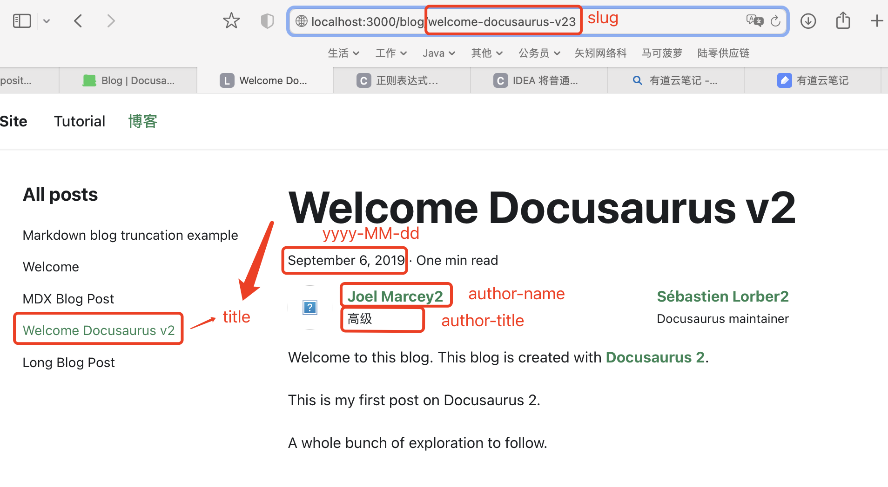
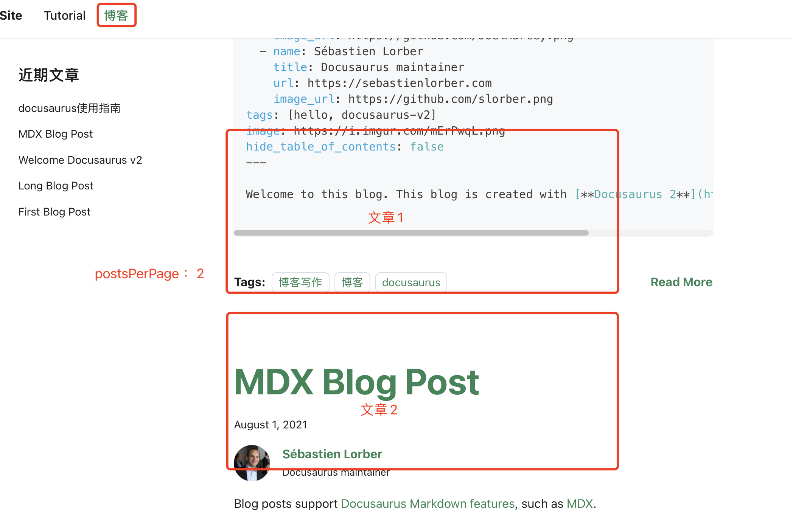
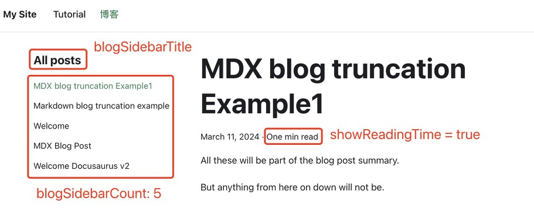
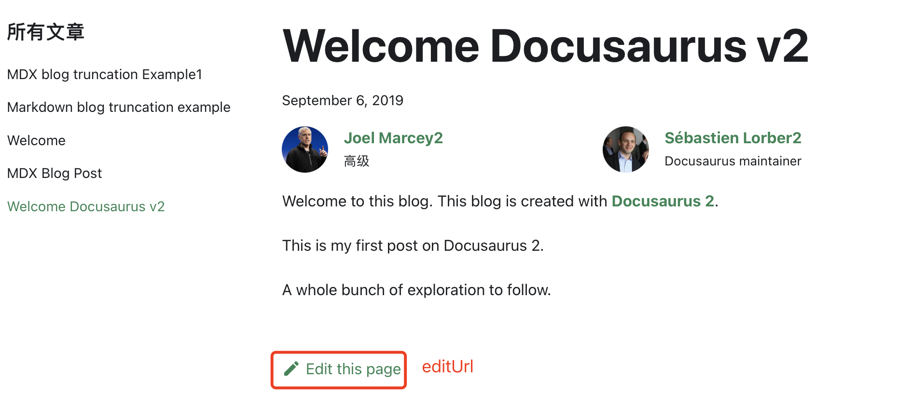

# Docusaurus使用指南

## 博客使用指南

### 添加博客目录

- 首先在根目录下创建目录 `blog`, 目录结构如下

  ```tex
  my-website
  ├── blog //新建该目录
  │   ├── 2019-05-28-hola.md
  │   ├── 2019-05-29-hello-world.md
  │   └── 2020-05-30-welcome.md
  ├── src
  ├── docusaurus.config.js
  ```

- 在`docusaurus.config.js`配置目录信息

  ```text
  module.exports = {
    themeConfig: {
      // ...
      navbar: {
        items: [
          // ...
          {to: 'blog', label: '博客', position: 'left'}, // or position: 'right'
        ],
      },
    },
  };
  ```

  **参数解释**

  `navbar`: 导航栏

  `items`：一个item就是一个导航栏菜单

  `label`: 导航栏菜单的名称

  `position`:该菜单的对其方式，left-左对齐，right-右对齐

  `to`: 将`/blog` 该导航栏菜单所对应的文件目录

### 新增文章

在`/blog`目录下新增博客，如/blog/2019-09-05-hello-docusaurus-v2.md

```markdown
---
title: Welcome Docusaurus v2
description: This is my first post on Docusaurus 2.
slug: welcome-docusaurus-v2
authors:
- name: Joel Marcey
  title: Co-creator of Docusaurus 1
  url: https://github.com/JoelMarcey
  image_url: https://github.com/JoelMarcey.png
- name: Sébastien Lorber
  title: Docusaurus maintainer
  url: https://sebastienlorber.com
  image_url: https://github.com/slorber.png
  tags: [hello, docusaurus-v2]
  image: https://i.imgur.com/mErPwqL.png
  hide_table_of_contents: false
---

Welcome to this blog. This blog is created with [**Docusaurus 2**](https://docusaurus.io/).

<!-- truncate -->

This is my first post on Docusaurus 2.

A whole bunch of exploration to follow.
```

**参数解释**

文件名称2019-09-05-hello-docusaurus-v2.md其中2019-09-05即blog的发布时间，展示在正文的标题下面。

`title`: 文章的标题。

`slug`: 站内文章的url地址

`authors/name`: 作者的名字

`authors/title`: 作者的其他信息，如职务等。

`image_url`: 头像图片网络地址

`url`: 头像点击链接



`<!-- truncate -->`: 用于md划分摘要和正文。

`{/* truncate */}`: 用于mdx划分摘要和正文。

### 博客参数配置

在`docusaurus.config.js`配置中配置如下

```js
presets: [
    [
      'classic',
      /** @type {import('@docusaurus/preset-classic').Options} */
      ({
        blog: {
          blogTitle: 'Docusaurus blog!',
          blogDescription: 'A Docusaurus powered blog!',
          postsPerPage: 'ALL',
          showReadingTime: true,
          blogSidebarTitle: 'All posts',
          blogSidebarCount: 5,
          editUrl:
            'https://github.com/facebook/docusaurus/tree/main/packages/create-docusaurus/templates/shared/'
        },
      }),
    ],
  ]
```

由于我边测边写，所以我这里以我本地的配置文件来讲解。

**参数说明**

`blogTitle`: SEO搜索引擎优化

`blogDescription`: SEO搜索引擎优化

`postsPerPage`: 博客主页分页。

`showReadingTime`: 顾名思义就是是否展示阅读时间。

`blogSidebarTitle`: 就是博客的标题

`blogSidebarCount`: 分页每一页的展示的文章数量，`blogSidebarCount: 'ALL'`则现实所有文章

`editUrl`: 编辑此页连接







### 全局作者信息

一般来说个人博客的作者都是博主，因此每篇博客的作者都是同一人，我们可以采用`/blog/authors.yml`中定义全局作者信息。

```yaml
jmarcey:
  name: Joel Marcey
  title: Co-creator of Docusaurus 1
  url: https://github.com/JoelMarcey
  image_url: https://github.com/JoelMarcey.png
  email: jimarcey@gmail.com

slorber:
  name: Sébastien Lorber
  title: Docusaurus maintainer
  url: https://sebastienlorber.com
  image_url: https://github.com/slorber.png
```

这样我们就可以在文章头部直接引用作者信息

```yaml
---
authors: jmarcey
---
```

多个作者可以这样：

```yaml
---
authors: [jmarcey, slorber]
---
```

还可以全局作者和文章内联作者混合使用

```yaml
---
authors:
  - 作者1
  - name: 作者2
    title: Inline Author Title
    url: https://github.com/inlineAuthor
    image_url: https://github.com/inlineAuthor
---
```

还可以在博客中对全局作者进行覆盖

```yaml
---
authors:
  - key: jmarcey
    title: Joel Marcey's new title //覆盖职位
  - key: slorber
    name: Sébastien Lorber's new name //覆盖姓名
---
```


