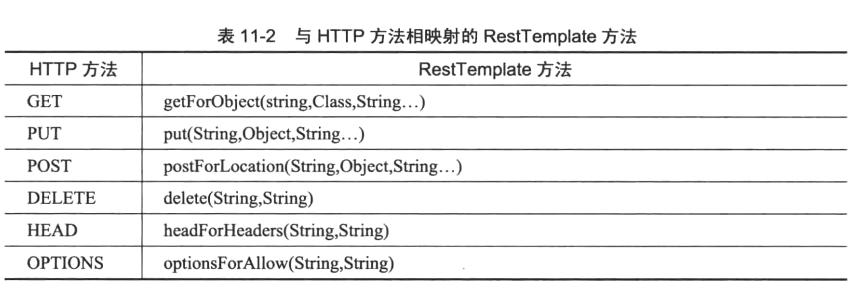

# Rest风格web开发
## [basic](basic)
本示例演示简单的Rest风格的web应用
>HttpStatus中定义了常见的状态码，如下图

## [basicwithannotations](basicwithannotations)
本示例演示了基于注解创建Rest Web服务
## [basicwithxml](basicwithxml)
本示例演示了基于XML创建Rest Web服务
## [exceptionhandling](exceptionhandling)
本示例演示了Rest Web使用异常处理机制
## [testing](testing)
该示例演示了Rest Web的单元测试

