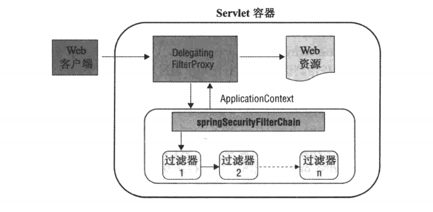
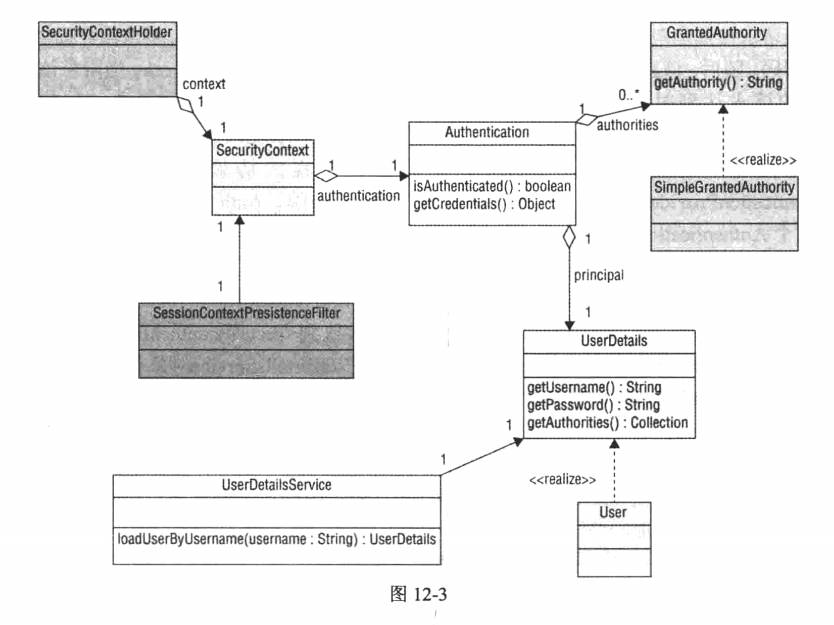
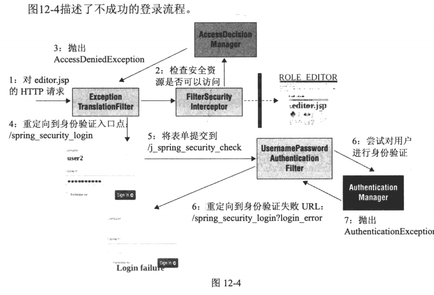
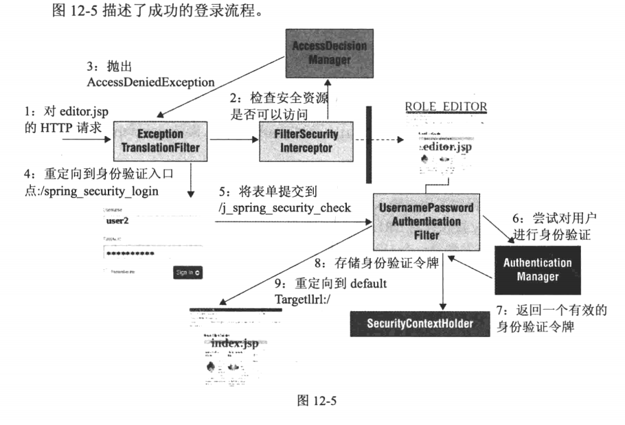
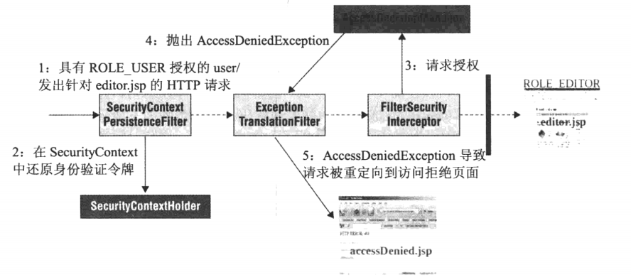

# 该章主要介绍Spring Security
## [configuring-and-using-spring-security](configuring-and-using-spring-security)
本示例演示了如何配置使用Spring Security

以下是Web请求的过程示意图：

## [accessing-userdetails-using-jdbc](accessing-userdetails-using-jdbc)
本示例演示了基于JDBC配置使用Spring Security
## [authorizing-web-requests](authorizing-web-requests)
该示例演示了Spring Security的授权，下图是授权的流程图，看不清的是`AccessDecisionManager`

## [authorizing-service-methods](authorizing-service-methods)
本示例演示了方法级别的授权
