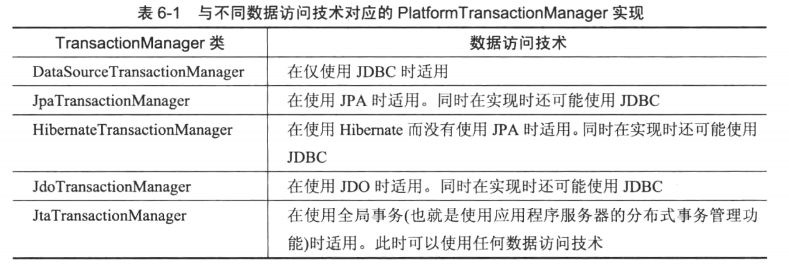
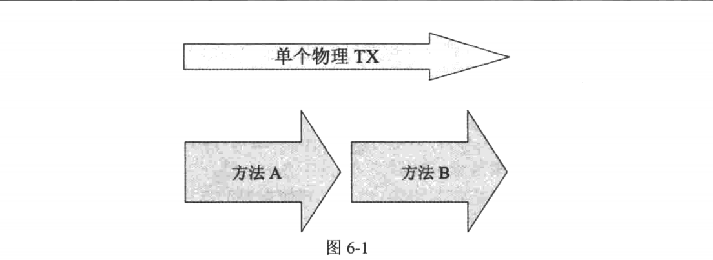

## [defining-transaction-with-jdbc](defining-transaction-with-jdbc)
本示例演示JDBC如何定义事务
## [configuring-platform-tx-manager](configuring-platform-tx-manager)
本示例演示Spring如何定义事务

## [enabling-declarative-tx-management](enabling-declarative-tx-management)
本示例演示Spring如何声明式事务
* 第一步启用基于注解的声明式事务`@EnableTransactionManagement`
```java
@Configuration
@EnableTransactionManagement
public class Ch6Configuration {}
```
* 第二步在需要开启事务的方法使用`@Transactional`注解进行标记
```java
@Transactional
public void transferMoney(long sourceAccountId, long targetAccountId, double amount) {}
```
>注意：Spring默认只对非检查异常RuntimeException及其派生异常导致的事务进行回滚。而Exception及其派生异常进行提交。如需修改可使用@Transactional(rollbackFor = Exception.class)更改回滚规则。
## [separating-service-layer](separating-service-layer)
该示例演示了如何将service层和dao层进行分离，类上放置`@Transactional`那么类中的所有方法都被事务化，类上和方法上都有该注解，那么方法上生命事务规则重写类上的。

如果像执行回滚，首先必须要有一个方法抛出异常，然后Spring根据用户配置的事务回滚规则决定最终是提交还是回滚。
>如何在没有异常抛出的情况下执行事务回滚？

如果想在没有异常抛出的情况下，让一个声明式事务管理回滚当前事务，可以如下操作:

```java
import org.springframework.transaction.TransactionStatus;
import org.springframework.transaction.annotation.Transactional;
import org.springframework.transaction.interceptor.TransactionAspectSupport;

public class SomeService {
    @Transactional
    public void transactionalMethod() {
        try {
            // 业务逻辑
        } catch (Exception e) {
            // TransactionStatus表示当前事务，将通过setRollbackOnly()将rollbackOnly设置为true,如果该为true方法调用结束后即使方法成功返回，也会进行回滚
            TransactionStatus transactionStatus = TransactionAspectSupport.currentTransactionStatus();
            transactionStatus.setRollbackOnly();
        }
    }
}
```
事务隔离级别`@Transactional(propagation = Propagation.REQUIRED)`

* 如果不存在事务，则创建一个事务。
* 如果存在一个由其他方法调用而开始的活动事务，则该方法和前者保持在一个事务当中
* 如果第二个方法抛出了一个可回滚的异常，那么整个物理事务都将回滚，至于第一个方法是否处理该异常并不重要
>同一个Bean一个事务方法调用另一个事务方法，如何保持事务？

由于Spring是使用代理实例来处理事务逻辑，实际Bean在调用完成后，代理实例才会进行事务处理，当实际Bean在调用自身的事务方法时将无法触发新的事务。为解决这个问题，允许目标Bean在其第一个方法体中访问当前代理实例，通过该代理实例执行第二个方法调用，第二个方法调用也会通过代理实例，完成事务。

```java
import org.springframework.aop.framework.AopContext;
import org.springframework.transaction.annotation.Propagation;
import org.springframework.transaction.annotation.Transactional;

public class someService {
    @Transactional
    public void transactionMethod() {
        // 业务逻辑
        // 通过该代理实例执行第二个方法调用，完成事务
        ((someService) AopContext.currentProxy()).anotherTransactionalMethod();
    }

    @Transactional(propagation = Propagation.REQUIRES_NEW)
    public void anotherTransactionalMethod() {
        // 业务逻辑
    }
}
```
## [using-txadvice-for-declarative-tx](using-txadvice-for-declarative-tx)
本示例演示了基于XML进行声明式事务

* 基于XML配置事务的规则
```xml
<tx:advice id="txAdvice" transaction-manager="transactionManager">
    <tx:attributes>
        <tx:method name="*" propagation="REQUIRED" />
    </tx:attributes>
</tx:advice>
```
相当于
```java
@Transactional(propagation = Propagation.REQUIRED)
public void transferMoney(long sourceAccountId, long targetAccountId, double amount) {}
```
* 将配置好的事务与Spring Bean绑定起来
```xml
<aop:config>
    <aop:advisor advice-ref="txAdvice" pointcut="bean(accountService)" />
</aop:config>
```
* 使用`@ImportResource("classpath:/beans-tx.xml")`加载Spring配置文件
## [using-transaction-template](using-transaction-template)
本示例演示了使用编程式事务
* 创建`TransactionTemplate`
```java
@Bean
public TransactionTemplate transactionTemplate() {
    TransactionTemplate transactionTemplate = new TransactionTemplate();
    transactionTemplate.setTransactionManager(transactionManager());
    // 在这里可以配置事务的规则
    transactionTemplate.setReadOnly(transactionTemplate().isReadOnly());
    transactionTemplate.setPropagationBehavior(TransactionDefinition.PROPAGATION_REQUIRED);
    return transactionTemplate;
}
```
* 将transactionTemplate注入到Service里面
* 使用`TransactionTemplate`
```java
@Override
public void transferMoney(final long sourceAccountId, final long targetAccountId, final double amount) {
    transactionTemplate.execute(new TransactionCallbackWithoutResult() {
        @Override
        protected void doInTransactionWithoutResult(TransactionStatus status) {
            Account sourceAccount = accountDao.find(sourceAccountId);
            Account targetAccount = accountDao.find(targetAccountId);
            sourceAccount.setBalance(sourceAccount.getBalance() - amount);
            targetAccount.setBalance(targetAccount.getBalance() + amount);
            accountDao.update(sourceAccount);
            accountDao.update(targetAccount);
        }
    });
} 
```
>注意：`TransactionTemplate`和`@Transactional`的默认规则一样，但`TransactionTemplate`不管检查式异常还是非检查式异常都会进行回滚。
## [using-platform-tx-manager](using-platform-tx-manager)
本示例介绍使用`PlatformTransactionManager`来进行编程式事务管理，相较于`TransactionTemplate`,`PlatformTransactionManager`更见的灵活，粒度也更细适合复杂的场景
## [advising-transactional-operations](advising-transactional-operations)
该示例演示了在事务之前或者之后执行逻辑-实现`MethodInterceptor`接口
