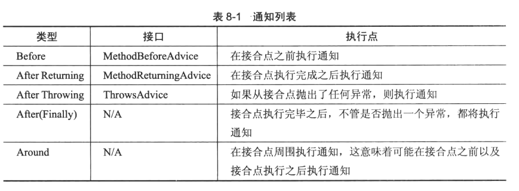
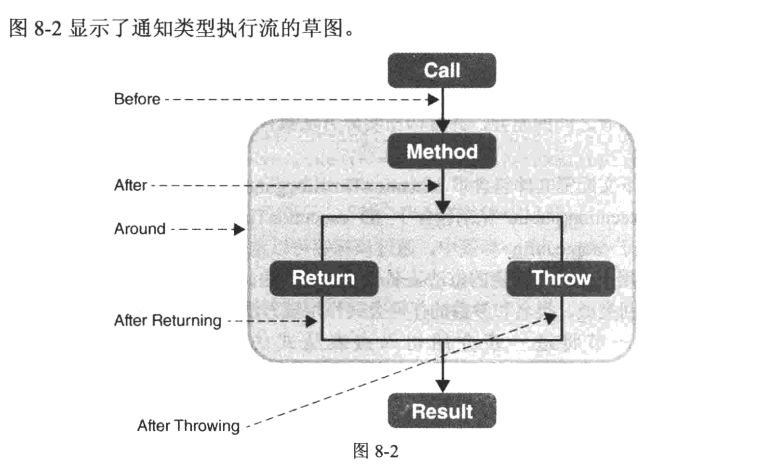

## [executiontimelogging](executiontimelogging)
该示例演示了如何定义`Before`和`After Returning`
>当同一个类中的一个方法调用另一个方法，后者就不能应用通知



## [executiontimeloggingthrowsadvice](executiontimeloggingthrowsadvice)
该示例演示了如何定义`After Throwing`
```java
public class ExecutionTimeLoggingThrowsAdvice implements ThrowsAdvice {

    public void afterThrowing(Method method, Object[] args, Object target, Exception ex) {
        String className = target.getClass().getCanonicalName();
        String methodName = method.getName();
        // 这里抛出的异常将会覆盖原有的异常by zero
        int i = 1/0;
        System.out.println("Execution of " + className + "#" + methodName + " ended with exception: " + ex.getMessage());
    }
}
```
>如果ThrowsAdvice中抛出异常，则该异常将会覆盖原异常。

## [executiontimeloggingwithafterfinally](executiontimeloggingwithafterfinally)
该示例演示了如何定义`After(Finally)`
## [executiontimeloggingwitharound](executiontimeloggingwitharound)
该示例演示了如何定义`Around`
>注意：只有 `Around` 支持 ProceedingJoinPoint，如果有多个切入点可以通过Ordered接口指定顺序
## [pointcutsextreme](pointcutsextreme)
该示例演示了其他切入点指示符。
* `within()的用法`
```java
// 匹配org.example包及其子包中所有类中的所有方法
@Before("within(org.example..*)")
public void before() {
    System.out.println("Before Advice with pointcut for Marker Method Annotation.");
}

// 匹配MyService类中的所有方法
@Before("within(org.example.MyService)")
public void before() {
    System.out.println("Before Advice with pointcut for Marker Method Annotation.");
}

// 匹配MyService类及其子类中的所有方法
@Before("within(org.example.MyService+)")
public void before() {
    System.out.println("Before Advice with pointcut for Marker Method Annotation.");
}
```
* `execution()`的用法，顺序依次是作用域（可缺省） 返回值类型 完全限定名 参数
```java
// 匹配org.example.bean.MyBean中的所有方法，无论返回值类型是什么，方法名是什么，参数是什么
@After(value = "execution(* org.example.bean.MyBean.*(..))")
public void after(JoinPoint joinPoint) {
    System.out.println("===5. After Advice.");
}

// 匹配org.example.bean.MyBean中的所有public作用域的方法
@After(value = "execution(public * org.example.bean.MyBean.*(..))")
public void after(JoinPoint joinPoint) {
    System.out.println("===5. After Advice.");
}

// 匹配org.example.bean.MyBean中的所有返回值是String类型、public修饰的方法
@After(value = "execution(public String org.example.bean.MyBean.*(..))")
public void after(JoinPoint joinPoint) {
    System.out.println("===5. After Advice.");
}

// 匹配org.example.bean.MyBean中的第一个参数被定义为long的、public修饰的方法
@After(value = "execution(public * org.example.bean.MyBean.*(long,..))")
public void after(JoinPoint joinPoint) {
    System.out.println("===5. After Advice.");
}
```
* 其他
```java
// 匹配所有后缀为Service的Bean
@After("bean(*Service)")
public void after(JoinPoint joinPoint) {
    System.out.println("===5. After Advice.");
}

// 匹配所有使用@MarkerAnnotation修饰的方法
@After("@annotation(org.example.markers.MarkerAnnotation)")
public void after(JoinPoint joinPoint) {
    System.out.println("===5. After Advice.");
}
@MarkerAnnotation
public void sayHello() {
    System.out.println("Hello..!");
}

// 匹配所有使用@MarkerAnnotation修饰的类
@Before("@within(org.example.markers.MarkerAnnotation)")
public void before() {
    System.out.println("Before Advice with pointcut for Marker Method Annotation.");
}

// 匹配实现了MarkerInterface接口Bean
@After("this(org.example.markers.MarkerInterface)")
public void after() {
    System.out.println("After Advice with pointcut for Marker Interface with this()");
}
public class MyBeanImpl implements MyBean, MarkerInterface {}
```
## [annotations](annotations)
该示例演示了基于注解来配置Spring容器
* 定义通知
```java
// @Component组件，告诉Spring这个类由Spring来管理
@Component
// 标记该类是一个通知
@Aspect
public class ExecutionOrderBefore {

    // 匹配所有包下public修饰的方方法
    @Before(value = "execution(public * *(..))")
    public void before(JoinPoint joinPoint) {
        System.out.println("===1. Before Advice.");
    }
}
```
* 定义通知，访问传递的参数
```java
// IOC注解，表示该类交给Spring管理
@Component
// 该类是一个通知类
@Aspect
public class ExecutionOrderBefore {

    // args(param)将方法的参数名称绑定到过滤器表达式，访问到传递的参数
    @Before(value = "execution(public * *(..)) && args(param)")
    public void before(JoinPoint joinPoint, String param) {
        System.out.println("===1. Before Advice." + param);
    }
}
```
* 定义切入点
```java
// @Component IOC的核心注解，表示该类交给Spring管理
@Component
// 标记该类是一个切面Aspect，它的作用是将切点比表达式和通知绑定起来，作用类似于<aop:config>标签
@Aspect
public class ExecutionOrderBeforeWithPointCut {

    // 定义切点，这里指匹配所有public修饰的任意包下的任意方法
    @Pointcut("execution(public * *(..))")
    public void anyPublicMethod()  {
    }

    // 定义通知Before，同时将切点和通知绑定起来
    @Before("anyPublicMethod()")
    public void beforeWithPointCut(JoinPoint joinPoint) {
        System.out.println("===1.1. Before Advice with @PointCut.");
    }
}
```
* 给通知绑定多个切点
```java
// IOC核心注解，用来告诉Spring该类交给Spring管理
@Component
// 切面（类），在切面中定义切点和通知，并将切点和通知进行绑定，其作用类似与XML中的<aop:config>
@Aspect
public class ExecutionOrderAfterWithMultiplePointCut {

    // 切点1，匹配所有包下所有类的public修饰的方法
    @Pointcut("execution(public * *(..))")
    public void anyPublicMethod() {
    }

    // 切点2，匹配所有使用`@MarkerAnnotation`修饰的方法
    @Pointcut("@annotation(org.example.MarkerAnnotation)")
    public void annotatedWithMarkerAnnotation() {
    }

    // 给通知绑定多个其切入点
    @After(value = "anyPublicMethod() & annotatedWithMarkerAnnotation()")
    public void afterWithMultiplePointcut(JoinPoint joinPoint) {
        System.out.println("===5.1. After Advice with Multiple Pointcut applied on method.");
    }
}
```
* 获取通知的返回值
```java
// 该类由Spring进行管理
@Component
// 表示切面（类），切面中用来定义切点和通知，并将他们绑定起来，类似XML中的<aop:config>
@Aspect
public class ExecutionOrderAfterReturning {

    // 匹配所有包下的所有类中public修饰及有返回值的方法，并接受返回值
    @AfterReturning(value = "execution(public * *(..))", returning = "result")
    public void afterReturning(JoinPoint joinPoint, String result) {
        System.out.println("===6. After Returning Advice." + result);
    }
}
```
* 访问方法返回的异常信息[ExecutionOrderAfterThrowing.java](annotationswithexception%2Fsrc%2Fmain%2Fjava%2Forg%2Fexample%2Faspect%2FExecutionOrderAfterThrowing.java)
```java
// 该类由Spring进行管理
@Component
// 该类是切面，在切面中我们常定义切点和通知，并将他们绑定起来，类似XML配置中的<aop:config>
@Aspect
public class ExecutionOrderAfterThrowing {

    // 抛出异常后进入，并获取到异常信息
    @AfterThrowing(value = "within(org.example.bean.MyOtherBeanImpl)", throwing = "t")
    public void afterThrowing(JoinPoint joinPoint, Throwable t) {
        System.out.println("===3 After throwing an exception: " + t.getMessage());
    }
}
```
## [declareparents](declareparents)
本示例演示类如何实现"多重继承"
```java
// 该类由Spring进行管理
@Component
// 这是一个切面（类），常用来定义切点和通知，并将他们绑定起来，类似于XML中的<aop:config>
@Aspect
public class GreekMythologyIntroducer {
    // 匹配Pegasus及其子类
    @DeclareParents(value = "org.example.bean.Pegasus+", defaultImpl = Bird.class)
    public static IBird iBird;
}
```
## [executiontimeloggingaspectj](executiontimeloggingaspectj)
该示例演示使用AspectJ框架
```java
// 该类由Spring进行管理
@Component
// 这是一个切面，在其中定义切点和通知的，并将它们绑定起来，类似与XML中的<aop:config>
@Aspect
public class ExecutionTimeLoggingAspectJ {

    // 匹配所有包下的所有类中的所有public修饰的方法
    @Around("execution(public * *(..))")
    public Object profile(ProceedingJoinPoint pjp) throws Throwable {
        // Step1:执行前的逻辑
        long startTime = System.nanoTime();

        String className = pjp.getTarget().getClass().getCanonicalName();
        String methodName = pjp.getSignature().getName();

        // Step2:执行pjp.proceed();
        Object output = pjp.proceed();
        
        // Step3:执行后的逻辑
        long elapsedTime = System.nanoTime() - startTime;
        System.out.println("Execution of " + className + "#" + methodName + " ended in " + new BigDecimal(elapsedTime).divide(new BigDecimal(1000000)) + " milliseconds");

        // Step4:返回执行结果
        return output;
    }
}
```
```xml
<!--包扫描-->
<context:component-scan base-package="org.example" />
<!--启用注解驱动，告诉Spring自动扫描并注册注解类及其依赖关系-->
<context:annotation-config/>

<!--启用AspectJ注解风格的AOP支持。可以在Spring应用程序中使用AspectJ注解（例如 @Aspect、@Pointcut、@Before、@After 等）来定义切面-->
<aop:aspectj-autoproxy/>
```
## [executiontimeloggingaspectjcglib](executiontimeloggingaspectjcglib)
该示例演示了在Spring中使用`cglib`, 只需要设置在`<aop:aspectj-autoproxy />` 中加上`proxy-target-class="true"` 属性就有JDK动态代理变成了`Cglib`
```xml
<!--包扫描-->
<context:component-scan base-package="org.example" />
<!--启用注解驱动-->
<context:annotation-config />
<!--启用AspectJ注解风格的AOP支持，并选择使用CGLIB代理方式（即基于类的代理）而非JDK动态代理（基于接口的代理）。-->
<aop:aspectj-autoproxy proxy-target-class="true" />
```
>CGLIB代理方式（基于类的代理）和JDK动态代理（基于接口的代理），它在创建代理对象的方式和代理的目标对象类型上存在差异
* CGLIB创建代理
```java
public class UserService {
    public void saveUser() {
        // 保存用户逻辑
    }
}

public class MyMethodInterceptor implements MethodInterceptor {
    @Override
    public Object intercept(Object obj, Method method, Object[] args, MethodProxy proxy) throws Throwable {
        // 在方法调用前或后添加逻辑
        return proxy.invokeSuper(obj, args);
    }
}

public class Main {
    public static void main(String[] args) {
        Enhancer enhancer = new Enhancer();
        enhancer.setSuperclass(UserService.class);
        enhancer.setCallback(new MyMethodInterceptor());
        UserService proxy = (UserService) enhancer.create();

        proxy.saveUser(); // 代理对象调用目标类的方法
    }
}
```
* JDK动态代理
```java
public interface UserService {
    void saveUser();
}

public class UserServiceImpl implements UserService {
    @Override
    public void saveUser() {
        // 保存用户逻辑
    }
}

public class MyInvocationHandler implements InvocationHandler {
    private Object target;

    public MyInvocationHandler(Object target) {
        this.target = target;
    }

    @Override
    public Object invoke(Object proxy, Method method, Object[] args) throws Throwable {
        // 在方法调用前或后添加逻辑
        return method.invoke(target, args);
    }
}

public class Main {
    public static void main(String[] args) {
        UserService userService = new UserServiceImpl();
        UserService proxy = (UserService) Proxy.newProxyInstance(
                userService.getClass().getClassLoader(),
                userService.getClass().getInterfaces(),
                new MyInvocationHandler(userService)
        );

        proxy.saveUser(); // 代理对象调用目标类的方法
    }
}

```
## [executiontimeloggingannotationconfig](executiontimeloggingannotationconfig)
本示例演示了使用注解配置Spring AOP
