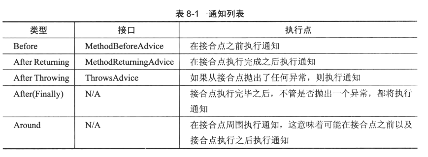
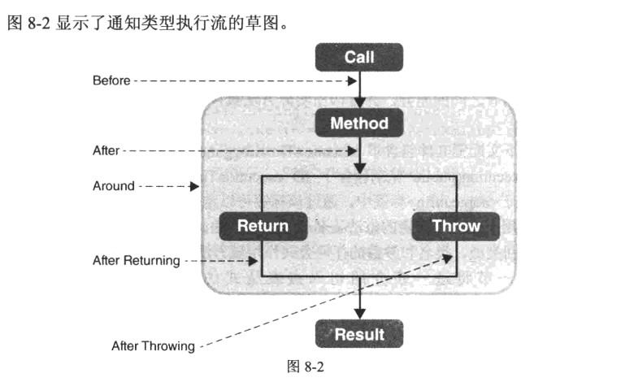

## [executiontimelogging](executiontimelogging)
该示例演示了如何定义`Before`和`After Returning`
>当同一个类中的一个方法调用另一个方法，后者就不能应用通知



## [executiontimeloggingthrowsadvice](executiontimeloggingthrowsadvice)
该示例演示了如何定义`After Throwing`
```java
public class ExecutionTimeLoggingThrowsAdvice implements ThrowsAdvice {

    public void afterThrowing(Method method, Object[] args, Object target, Exception ex) {
        String className = target.getClass().getCanonicalName();
        String methodName = method.getName();
        // 这里抛出的异常将会覆盖原有的异常by zero
        int i = 1/0;
        System.out.println("Execution of " + className + "#" + methodName + " ended with exception: " + ex.getMessage());
    }
}
```
>如果ThrowsAdvice中抛出异常，则该异常将会覆盖原异常。

## [executiontimeloggingwithafterfinally](executiontimeloggingwithafterfinally)
该示例演示了如何定义`After(Finally)`
## [executiontimeloggingwitharound](executiontimeloggingwitharound)
该示例演示了如何定义`Around`
>注意：只有 `Around` 支持 ProceedingJoinPoint，如果有多个切入点可以通过Ordered接口指定顺序
## [pointcutsextreme](pointcutsextreme)
该示例演示了其他切入点指示符。
* `within()的用法`
```java
// 匹配org.example包及其子包中所有类中的所有方法
@Before("within(org.example..*)")
public void before() {
    System.out.println("Before Advice with pointcut for Marker Method Annotation.");
}

// 匹配MyService类中的所有方法
@Before("within(org.example.MyService)")
public void before() {
    System.out.println("Before Advice with pointcut for Marker Method Annotation.");
}

// 匹配MyService类及其子类中的所有方法
@Before("within(org.example.MyService+)")
public void before() {
    System.out.println("Before Advice with pointcut for Marker Method Annotation.");
}
```
* `execution()`的用法，顺序依次是作用域（可缺省） 返回值类型 完全限定名 参数
```java
// 匹配org.example.bean.MyBean中的所有方法，无论返回值类型是什么，方法名是什么，参数是什么
@After(value = "execution(* org.example.bean.MyBean.*(..))")
public void after(JoinPoint joinPoint) {
    System.out.println("===5. After Advice.");
}

// 匹配org.example.bean.MyBean中的所有public作用域的方法
@After(value = "execution(public * org.example.bean.MyBean.*(..))")
public void after(JoinPoint joinPoint) {
    System.out.println("===5. After Advice.");
}

// 匹配org.example.bean.MyBean中的所有返回值是String类型、public修饰的方法
@After(value = "execution(public String org.example.bean.MyBean.*(..))")
public void after(JoinPoint joinPoint) {
    System.out.println("===5. After Advice.");
}

// 匹配org.example.bean.MyBean中的第一个参数被定义为long的、public修饰的方法
@After(value = "execution(public * org.example.bean.MyBean.*(long,..))")
public void after(JoinPoint joinPoint) {
    System.out.println("===5. After Advice.");
}
```
* 其他
```java
// 匹配所有后缀为Service的Bean
@After("bean(*Service)")
public void after(JoinPoint joinPoint) {
    System.out.println("===5. After Advice.");
}

// 匹配所有使用@MarkerAnnotation修饰的方法
@After("@annotation(org.example.markers.MarkerAnnotation)")
public void after(JoinPoint joinPoint) {
    System.out.println("===5. After Advice.");
}
@MarkerAnnotation
public void sayHello() {
    System.out.println("Hello..!");
}

// 匹配所有使用@MarkerAnnotation修饰的类
@Before("@within(org.example.markers.MarkerAnnotation)")
public void before() {
    System.out.println("Before Advice with pointcut for Marker Method Annotation.");
}

// 匹配实现了MarkerInterface接口Bean
@After("this(org.example.markers.MarkerInterface)")
public void after() {
    System.out.println("After Advice with pointcut for Marker Interface with this()");
}
public class MyBeanImpl implements MyBean, MarkerInterface {}
```
## [executiontimeloggingaspectj](executiontimeloggingaspectj)
该示例演示了基于XML在Spring中使用`Aspectj`。
## [executiontimeloggingaspectjcglib](executiontimeloggingaspectjcglib)
该示例演示了基于XML在Spring中使用`cglib`, 只需要设置在`<aop:aspectj-autoproxy />` 中加上`proxy-target-class="true"` 属性就有JDK动态代理变成了`Cglib`
## [annotations](annotations)
该示例演示了基于 Java 的配置
