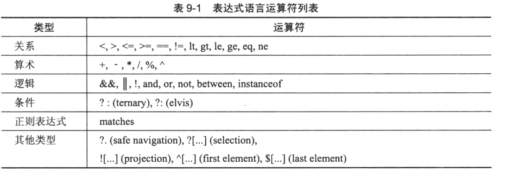

# EL表达式
## [xmlconfig](xmlconfig)
本示例演示类基于XML使用SpEL
```xml
<bean id="show1" class="org.example.MyBean">
    <!--systemProperties是一个保留字，它可以根据一个键值检索系统属性-->
    <property name="message" value="#{systemProperties['user.language']}" />
</bean>
```
## [annotationconfig](annotationconfig)
本示例演示类基于注解使用SpEL
```java
@Component
public class MyBean {

    //systemProperties是一个保留字，它可以根据一个键值检索系统属性
    @Value("#{systemProperties['user.language']}")
    private String message;

    public String getMessage() {
        return message;
    }
}
```
## [helloworld](helloworld)
本示例演示了创建SpEL分析器
```java
// SpelExpressionParser主要用于字符串的解析，解析到已编译好的Expression对象中
private ExpressionParser parser = new SpelExpressionParser();
public void helloWorldParsedOK() {
    // 尝试解析字符串Hello World!
    Expression expression = parser.parseExpression("'Hello World!'");
    // 尝试获取解析后的内容。
    String value = expression.getValue(String.class);
    assertThat(value, is("Hello World!"));
}
```
分析器默认使用前缀"#"，后缀为"}",但是也提供了这种修改这种默认方式的方法
```java
@Test
public void helloWorldParsedWithDifferentPrefixAndSuffixOK() {
    // 使用下划线"_"作为前后缀来进行解析
    Expression exp = parser.parseExpression("_'Hello World!'_", new TemplateParserContext("_", "_"));
    String value = exp.getValue(String.class);
    assertThat(value, is("Hello World!"));
}
```
>#{}和${}的区别
* #{}常用于XML配置文件或注解中，例如Spring的bean定义、注解中的@Value注解等。
```xml
<bean id="myBean" class="com.example.MyBean">
    <property name="propertyValue" value="#{someBean.someProperty}" />
</bean>
```
```java
@Value("#{someBean.someProperty}")
private String propertyValue;
```
* ${} 表达式常用于属性文件（例如.properties文件）中
```properties
db.url=jdbc:mysql://${db.host}:${db.port}/mydatabase
```
## [methodinvocation](methodinvocation)
该示例演示来SpEL调用构造方法、方法、静态方法。
```xml
<bean id="show2" class="org.example.Show">
    <property name="instrument" value="Guitar" />
    <property name="song" value="#{show2.guitarSong()}" />
</bean>
```
## [variables](variables)
本示例演示了SpEL如何使用变量和函数
* 使用#{..}访问存在的变量
```java
public void variableRegisteredOK() {
    //SpEL中使用StandardEvaluationContext查找表达式中存在的任何变量。
    StandardEvaluationContext context = new StandardEvaluationContext();
    context.setVariable("message", "Hello World!");
    String value = parser.parseExpression("#message").getValue(context, String.class);
    assertThat(value, is("Hello World!"));
}
```
* 访问根对象
```java
public void rootVariableRegisteredOK() {
        // 如果表达式中遇到了未知的方法或者属性，就会使用跟对象进行解析
    StandardEvaluationContext context = new StandardEvaluationContext();
    context.setRootObject(new MyBean());
//        assertTrue(parser.parseExpression("#root").getValue(context) instanceof MyBean);
assertThat(parser.parseExpression("#root.property").getValue(context), is("property"));
}
```
* 访问系统属性和环境
```java
public void systemPropertyFetchedOK() {
    StandardEvaluationContext context = new StandardEvaluationContext();
    context.setBeanResolver(new BeanFactoryResolver(new AnnotationConfigApplicationContext(org.example.ApplicationConfig.class)));
    String value = parser.parseExpression("@systemProperties['java.version']").getValue(context, String.class);
    assertThat(value, startsWith("1.8"));
}

public void systemEnvironmentVariableFetchedOK() {
    StandardEvaluationContext context = new StandardEvaluationContext();
    context.setBeanResolver(new BeanFactoryResolver(new AnnotationConfigApplicationContext(org.example.ApplicationConfig.class)));
    String value = parser.parseExpression("@systemEnvironment[JAVA_HOME]").getValue(context, String.class);
    System.out.println(value);
}
```
* 访问集合
```java
@Test
public void inlineListCreatedOK() {
    List<Integer> value = parser.parseExpression("{1,2,3}").getValue(List.class);
    assertThat(value, hasItems(1, 2, 3));
}

@Test
public void inlineListOfListsCreatedOK() {
    List<List<Integer>> value = parser.parseExpression("{{1,2},{3,4},{5,6}}").getValue(List.class);
    assertThat(value, hasItems(Arrays.asList(1,2), Arrays.asList(3,4), Arrays.asList(5,6)));
}
```
* 访问自定义方法[functions](functions)
```java
public void functionRegisteredOK() throws NoSuchMethodException {
    StandardEvaluationContext context = new StandardEvaluationContext();
    context.registerFunction("capitalize", StringUtils.class.getDeclaredMethod("capitalize", new Class[] { String.class }));

    String value = parser.parseExpression("#capitalize('hello')").getValue(context, String.class);
    assertThat(value, is("Hello"));
}
```

## [operators](operators)
本示例演示了SpEL中的运算符
* 关系运算符
```java
public void relationalOperatorsWorkOK() {
    assertThat(p.parseExpression("1<2").getValue(Boolean.class), is(true));
    assertThat(p.parseExpression("2>1").getValue(Boolean.class), is(true));
    assertThat(p.parseExpression("3<=3").getValue(Boolean.class), is(true));
    assertThat(p.parseExpression("3>=3").getValue(Boolean.class), is(true));
    assertThat(p.parseExpression("3==3").getValue(Boolean.class), is(true));
    assertThat(p.parseExpression("3!=4").getValue(Boolean.class), is(true));

    assertThat(p.parseExpression("1 lt 2").getValue(Boolean.class), is(true));
    assertThat(p.parseExpression("2 gt 1").getValue(Boolean.class), is(true));
    assertThat(p.parseExpression("3 le 3").getValue(Boolean.class), is(true));
    assertThat(p.parseExpression("3 ge 3").getValue(Boolean.class), is(true));
    assertThat(p.parseExpression("3 eq 3").getValue(Boolean.class), is(true));
    assertThat(p.parseExpression("3 ne 4").getValue(Boolean.class), is(true));
}
```
* 算术运算符
```java
public void arithmeticOperatorsWorkOK() {
    assertThat(p.parseExpression("1+1").getValue(Integer.class), is(2));
    assertThat(p.parseExpression("1-1").getValue(Integer.class), is(0));
    assertThat(p.parseExpression("2*2").getValue(Integer.class), is(4));
    assertThat(p.parseExpression("2/2").getValue(Integer.class), is(1));
    assertThat(p.parseExpression("5%2").getValue(Integer.class), is(1));
    assertThat(p.parseExpression("2^3").getValue(Integer.class), is(8));

    assertThat(p.parseExpression("5 mod 2").getValue(Integer.class), is(1));
}
```
* 逻辑运算符
```java
public void logicalOperatorsWorkOK() {
    assertThat(p.parseExpression("true && false").getValue(Boolean.class), is(false));
    assertThat(p.parseExpression("true || false").getValue(Boolean.class), is(true));
    assertThat(p.parseExpression("!false").getValue(Boolean.class), is(true));

    assertThat(p.parseExpression("true and false").getValue(Boolean.class), is(false));
    assertThat(p.parseExpression("true or false").getValue(Boolean.class), is(true));
    assertThat(p.parseExpression("not false").getValue(Boolean.class), is(true));

    assertThat(p.parseExpression("3 between {2,5}").getValue(Boolean.class), is(true));
}

public void instanceOfCheckWorksOK() {
    Expression exp = parser.parseExpression("'Hello' instanceof T(String)");
    Boolean value = exp.getValue(Boolean.class);
    assertThat(value, is(true));
}
```
* 条件运算符
```java
@Test
public void ternaryOperatorWorksOK() {
    User user1 = new User();
    StandardEvaluationContext context1 = new StandardEvaluationContext(user1);
    // 这里的name属性是根对象的属性，是不区分大小写的
    assertThat(p.parseExpression("name != null ? 'Mert' : 'Funda'").getValue(context1, String.class), is("Funda"));
    assertThat(p.parseExpression("Name != null ? 'Mert' : 'Funda'").getValue(context1, String.class), is("Funda"));

    User user2 = new User("Mert");
    StandardEvaluationContext context2 = new StandardEvaluationContext(user2);
    assertThat(p.parseExpression("Name != null ? 'Mert' : 'Funda'").getValue(context2, String.class), is("Mert"));
    assertThat(p.parseExpression("name != null ? 'Mert' : 'Funda'").getValue(context2, String.class), is("Mert"));
}

@Test
public void elvisOperatorWorksOK() {
    User user1 = new User();
    StandardEvaluationContext context1 = new StandardEvaluationContext(user1);
    // name == null 则将name = 'Funda'，否则name的值不变，
    assertThat(p.parseExpression("Name ?: 'Funda'").getValue(context1, String.class), is("Funda"));

    User user2 = new User("Mert");
    StandardEvaluationContext context2 = new StandardEvaluationContext(user2);
    assertThat(p.parseExpression("Name ?: 'Funda'").getValue(context2, String.class), is("Mert"));
}
```
* 正则表达式运算符
```java
@Test
public void relationalOperatorsWorkOK() {
    assertThat(p.parseExpression("35 matches '[0-9]+'").getValue(Boolean.class), is(true));
    assertThat(p.parseExpression("'John' matches '[A-Za-z]+'").getValue(Boolean.class), is(true));
}
```
* 安全导航符
```java
@Test
public void safeNavigationOperatorsWorkOK() {
    Employee employee = new Employee("Mert");
    StandardEvaluationContext context = new StandardEvaluationContext(employee);

    // 如果Address不为null，则返回name属性，如果Address为null则返回null
    assertThat(p.parseExpression("Address?.Name").getValue(context, String.class), is(nullValue()));
}
```
* 集合选择和投影
```java
@Test
public void collectionSelectedOK() {
    StandardEvaluationContext context = new StandardEvaluationContext();
    context.setRootObject(Arrays.asList(1,2,3,4,5,6,7,8,9));
    // 将所有的偶数删选出来
    List<Integer> evenNumbers = parser.parseExpression("#root.?[#this%2 == 0 ?: false]").getValue(context, List.class);
    assertThat(evenNumbers, hasItems(2, 4, 6, 8));
}

@Test
public void collectionProjectedOK() {
    StandardEvaluationContext context = new StandardEvaluationContext();
    context.setRootObject(Arrays.asList(
    new Worker("Mert", Country.DE),
    new Worker("Funda", Country.TR),
    new Worker("Tugce", Country.USA)));
    // 从根对象中获取每个Worker对象的birthPlace属性，并将其收集到一个列表里面
    List<Country> birthPlaces = parser.parseExpression("#root.![#this.birthPlace]").getValue(context, List.class);
    assertThat(birthPlaces, hasItems(Country.TR, Country.USA, Country.DE));
}
```
* 选择集合的第一个(^[...])和最后一个元素($[...])
```java
@Test
public void collectionFirstElementAccessOK() {
    StandardEvaluationContext context = new StandardEvaluationContext();
    context.setRootObject(Arrays.asList(1,2,3,4,5,6,7,8,9));
    //找到第一个大于3的元素
    Integer element = parser.parseExpression("#root.^[#this>3]").getValue(context, Integer.class);
    assertThat(element, is(4));
}

@Test
public void collectionLastElementAccessOK() {
    StandardEvaluationContext context = new StandardEvaluationContext();
    context.setRootObject(Arrays.asList(1,2,3,4,5,6,7,8,9));
    // 找到最后一个大于3的元素
    Integer element = parser.parseExpression("#root.$[#this>3]").getValue(context, Integer.class);
    assertThat(element, is(9));
}
```
## [utilities](utilities)
本示例演示了SpEL所提供的实用工具
* 访问SpringBean
```java
@Test
public void springBeanAccessWorksOK() {
    StandardEvaluationContext context = new StandardEvaluationContext();
    context.setBeanResolver(new BeanFactoryResolver(new AnnotationConfigApplicationContext(ApplicationConfig.class)));
    Expression exp = parser.parseExpression("@myBean.sayHello()");
    String value = exp.getValue(context, String.class);
    assertThat(value, is("Hello!"));
}
```