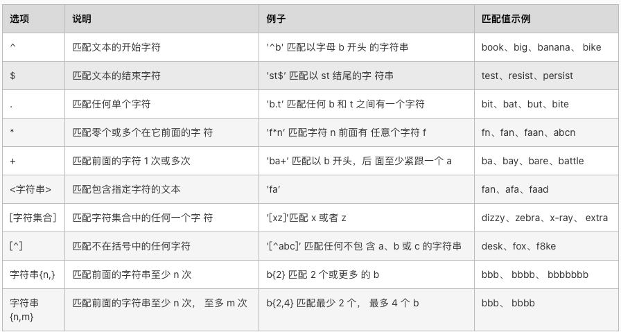
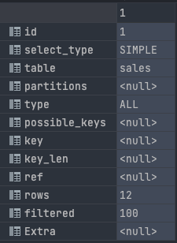

# 正则表达式


* `^`表示匹配字符串的开头
```sql
-- 表示字符串'abcdefg'是否以字符'a'开始。1-匹配，0-不匹配
select 'abcdefg' regexp '^a';
```
* `$`表示匹配字符的串的结尾
```sql
-- 表示字符串'abcdefg'是否以字符'g'结尾。1-匹配，0-不匹配
select 'abcdefg' regexp 'g$';
```
* `.`表示匹配任意一个字符
```sql
-- 表示字符串'abcdefg'是否以包含字符'h','f'。1-匹配，0-不匹配
select 'abcdefg' regexp '.h', 'abcdefg' regexp '.f';
```
* `[...]`表示匹配括号内的任意字符
```sql
-- 表示字符串'abcdefg'是否包含'w','c','x'中任意一个。1-匹配，0-不匹配
select 'abcdefg' regexp '[wcx]'
```
* `[^...]`表示不匹配括号内的任意字符，和`[...]`刚好相反
```sql
-- 表示字符串'efg'不匹配'XYZ'中任意字符。1-是，0-否
select 'efg' regexp '[^XYZ]','X' regexp '[^XYZ]'
```
